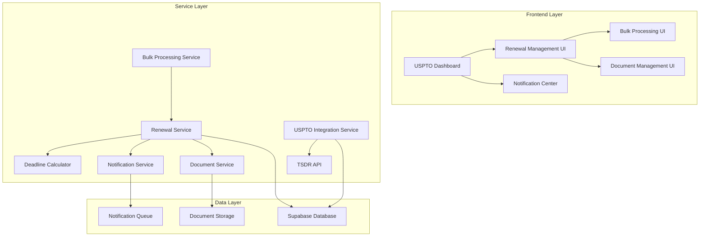

# Design Document

## Overview

The USPTO Trademark Renewal Enhancement system builds upon the existing USPTO service workflow to provide comprehensive deadline tracking, automated notifications, and enhanced document management. The design leverages the current TSDR API integration, Supabase database structure, and React-based UI components while adding new services for deadline management, notification systems, and bulk processing capabilities.

## Architecture

### High-Level Architecture



### Component Integration

The enhancement integrates with existing components:
- **USPTOService**: Extended with renewal-specific methods
- **TrademarkResultsTable**: Enhanced with renewal status indicators
- **TrademarkDetail**: Added renewal timeline and action buttons
- **Database**: New tables for deadline tracking and notifications

## Components and Interfaces

### Core Services

#### RenewalService
```typescript
interface RenewalService {
  calculateDeadlines(trademark: TrademarkResult): RenewalDeadlines;
  trackRenewalStatus(serialNumber: string): Promise<RenewalStatus>;
  scheduleNotifications(trademark: TrademarkResult, preferences: NotificationPreferences): Promise<void>;
  processRenewal(renewalData: RenewalFormData): Promise<RenewalResult>;
  getBulkRenewalEligibility(trademarks: TrademarkResult[]): Promise<BulkEligibilityResult>;
}
```

#### DeadlineCalculator
```typescript
interface DeadlineCalculator {
  calculateSection8Deadline(registrationDate: string): DeadlineInfo;
  calculateSection15Deadline(registrationDate: string): DeadlineInfo;
  calculateGracePeriods(baseDeadline: string): GracePeriodInfo;
  getNextMajorDeadline(trademark: TrademarkResult): DeadlineInfo;
  validateDeadlineEligibility(trademark: TrademarkResult): EligibilityResult;
}
```

#### NotificationService
```typescript
interface NotificationService {
  scheduleDeadlineNotifications(trademark: TrademarkResult, intervals: number[]): Promise<void>;
  sendClientNotification(notification: ClientNotification): Promise<NotificationResult>;
  processNotificationQueue(): Promise<void>;
  trackNotificationDelivery(notificationId: string): Promise<DeliveryStatus>;
  updateNotificationPreferences(clientId: string, preferences: NotificationPreferences): Promise<void>;
}
```

#### BulkProcessingService
```typescript
interface BulkProcessingService {
  validateBulkRenewals(trademarks: TrademarkResult[]): Promise<ValidationResult[]>;
  processBulkRenewals(renewals: BulkRenewalRequest[]): Promise<BulkProcessingResult>;
  trackBulkProgress(batchId: string): Promise<ProgressStatus>;
  generateBulkReport(batchId: string): Promise<BulkReport>;
}
```

### Data Models

#### Enhanced TrademarkResult
```typescript
interface EnhancedTrademarkResult extends TrademarkResult {
  deadlines: TrademarkDeadlines;
  renewalStatus: RenewalStatus;
  renewalHistory: RenewalEvent[];
  notificationSettings: NotificationPreferences;
  billingInfo: RenewalBillingInfo;
}
```

#### RenewalDeadlines
```typescript
interface RenewalDeadlines {
  section8: DeadlineInfo;
  section15?: DeadlineInfo;
  gracePeriod?: DeadlineInfo;
  nextMajorDeadline: DeadlineInfo;
  calculatedAt: string;
  lastUpdated: string;
}
```

#### NotificationPreferences
```typescript
interface NotificationPreferences {
  clientId: string;
  emailEnabled: boolean;
  smsEnabled: boolean;
  dashboardEnabled: boolean;
  reminderIntervals: number[]; // days before deadline
  contactEmails: string[];
  escalationContacts: string[];
  customMessage?: string;
}
```

### UI Components

#### RenewalDashboard
- Consolidated view of all trademark renewal statuses
- Filterable by status, client, deadline proximity
- Bulk action capabilities
- Export and reporting functions

#### RenewalTimelineComponent
- Visual timeline showing all renewal deadlines
- Interactive deadline management
- Status indicators and progress tracking
- Integration with calendar systems

#### BulkRenewalProcessor
- Multi-step wizard for bulk renewals
- Progress tracking and error handling
- Validation and confirmation steps
- Batch reporting and audit trails

#### NotificationCenter
- Centralized notification management
- Template customization
- Delivery tracking and analytics
- Client communication history

## Data Models

### Database Schema Extensions

#### renewal_deadlines table
```sql
CREATE TABLE renewal_deadlines (
    id UUID PRIMARY KEY DEFAULT gen_random_uuid(),
    trademark_id UUID NOT NULL,
    serial_number TEXT NOT NULL,
    registration_number TEXT,
    deadline_type TEXT NOT NULL, -- 'section8', 'section15', 'grace_period'
    due_date DATE NOT NULL,
    grace_period_end DATE,
    status TEXT NOT NULL DEFAULT 'pending', -- 'pending', 'completed', 'overdue', 'expired'
    calculated_at TIMESTAMPTZ NOT NULL DEFAULT NOW(),
    last_updated TIMESTAMPTZ NOT NULL DEFAULT NOW(),
    metadata JSONB,
    created_at TIMESTAMPTZ NOT NULL DEFAULT NOW()
);
```

#### renewal_notifications table
```sql
CREATE TABLE renewal_notifications (
    id UUID PRIMARY KEY DEFAULT gen_random_uuid(),
    trademark_id UUID NOT NULL,
    client_id UUID NOT NULL,
    notification_type TEXT NOT NULL, -- 'deadline_reminder', 'status_change', 'document_required'
    scheduled_date TIMESTAMPTZ NOT NULL,
    sent_date TIMESTAMPTZ,
    delivery_status TEXT DEFAULT 'pending', -- 'pending', 'sent', 'delivered', 'failed'
    recipient_email TEXT NOT NULL,
    subject TEXT NOT NULL,
    content TEXT NOT NULL,
    metadata JSONB,
    created_at TIMESTAMPTZ NOT NULL DEFAULT NOW()
);
```

#### renewal_batches table
```sql
CREATE TABLE renewal_batches (
    id UUID PRIMARY KEY DEFAULT gen_random_uuid(),
    user_id UUID NOT NULL,
    batch_name TEXT NOT NULL,
    status TEXT NOT NULL DEFAULT 'processing', -- 'processing', 'completed', 'failed', 'partial'
    total_count INTEGER NOT NULL,
    processed_count INTEGER DEFAULT 0,
    success_count INTEGER DEFAULT 0,
    error_count INTEGER DEFAULT 0,
    started_at TIMESTAMPTZ NOT NULL DEFAULT NOW(),
    completed_at TIMESTAMPTZ,
    metadata JSONB,
    created_at TIMESTAMPTZ NOT NULL DEFAULT NOW()
);
```

## Error Handling

### Error Categories

1. **API Errors**: USPTO TSDR API failures, rate limiting, authentication issues
2. **Data Validation Errors**: Invalid trademark data, missing required fields
3. **Deadline Calculation Errors**: Invalid dates, missing registration information
4. **Notification Errors**: Email delivery failures, invalid contact information
5. **Bulk Processing Errors**: Partial failures, validation errors, timeout issues

### Error Handling Strategy

```typescript
interface ErrorHandler {
  handleAPIError(error: USPTOAPIError): Promise<ErrorRecoveryResult>;
  handleValidationError(error: ValidationError): ValidationErrorResponse;
  handleNotificationError(error: NotificationError): Promise<RetryResult>;
  handleBulkProcessingError(error: BulkProcessingError): Promise<PartialRecoveryResult>;
}
```

### Retry Mechanisms

- **API Calls**: Exponential backoff with circuit breaker pattern
- **Notifications**: Retry queue with escalation after multiple failures
- **Bulk Processing**: Individual item retry with batch continuation
- **Deadline Calculations**: Fallback to manual calculation with alerts

## Testing Strategy

### Unit Testing

1. **Service Layer Testing**
   - Deadline calculation accuracy
   - Notification scheduling logic
   - Bulk processing validation
   - Error handling scenarios

2. **Component Testing**
   - UI component rendering
   - User interaction handling
   - Data display accuracy
   - Form validation

### Integration Testing

1. **API Integration**
   - USPTO TSDR API connectivity
   - Data parsing and validation
   - Error response handling
   - Rate limiting compliance

2. **Database Integration**
   - Data persistence accuracy
   - Query performance
   - Transaction integrity
   - Migration compatibility

### End-to-End Testing

1. **Renewal Workflow**
   - Complete renewal process
   - Multi-step form validation
   - Document generation
   - Payment processing

2. **Notification System**
   - Automated notification delivery
   - Client response handling
   - Escalation procedures
   - Audit trail generation

3. **Bulk Processing**
   - Large batch processing
   - Error recovery
   - Progress tracking
   - Report generation

### Performance Testing

1. **Load Testing**
   - Concurrent user handling
   - Database query optimization
   - API rate limit management
   - Memory usage monitoring

2. **Scalability Testing**
   - Large dataset handling
   - Bulk operation performance
   - Notification queue processing
   - Storage capacity planning

### Security Testing

1. **Authentication & Authorization**
   - User access controls
   - Client data isolation
   - API key security
   - Session management

2. **Data Protection**
   - Sensitive data encryption
   - Audit trail integrity
   - Backup and recovery
   - Compliance validation