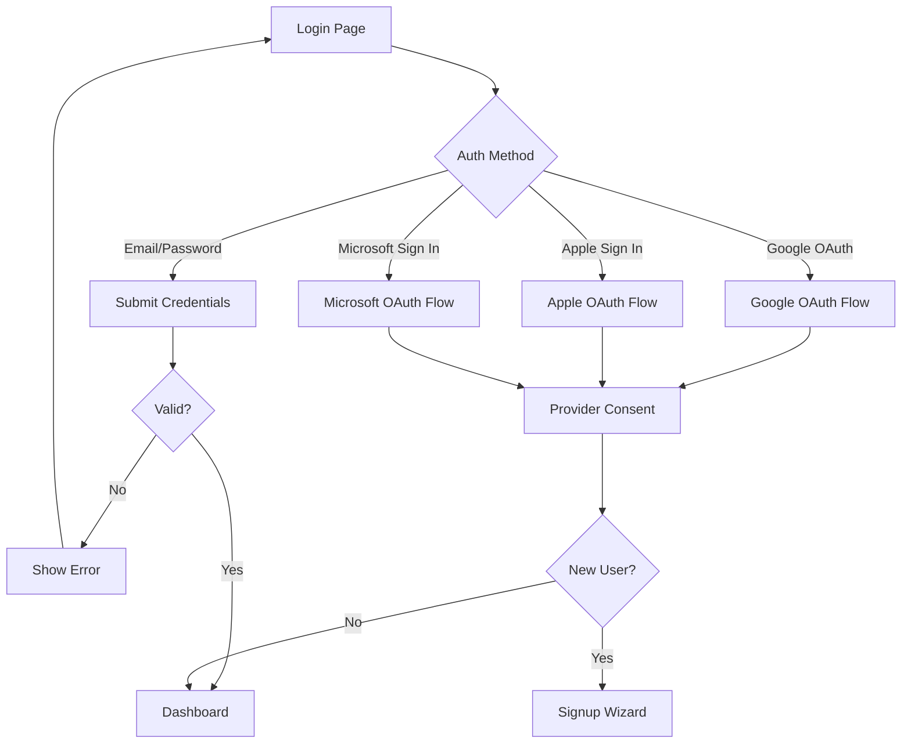
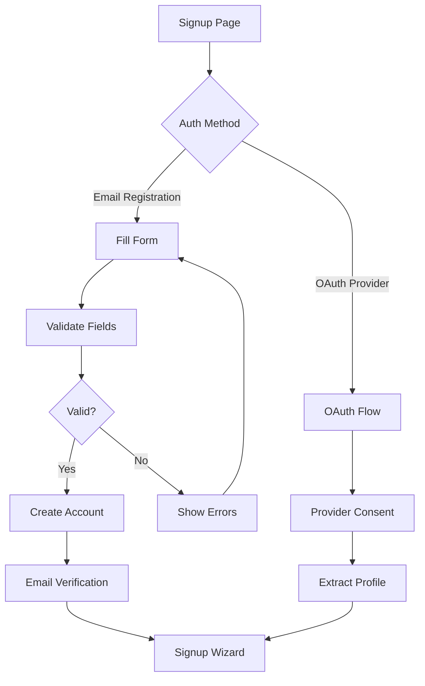

# ROSS.AI Authentication & Signup Wizard Guide

## Overview

ROSS.AI provides a comprehensive authentication system with multiple sign-in methods and an intelligent signup wizard that adapts based on firm size. The authentication flow ensures secure access while the wizard provides tailored onboarding experiences - solo practitioners get a streamlined setup while larger firms receive comprehensive configuration options for compliance, team management, and enterprise features.

## Table of Contents

1. [Authentication Overview](#authentication-overview)
2. [Login Page](#login-page)
3. [Sign Up Page](#sign-up-page)
4. [Authentication Methods](#authentication-methods)
5. [Firm Size Categories](#firm-size-categories)
6. [Wizard Flow by Firm Size](#wizard-flow-by-firm-size)
7. [Step Details](#step-details)
8. [Conditional Logic](#conditional-logic)
9. [Feature Availability](#feature-availability)
10. [Technical Implementation](#technical-implementation)

## Authentication Overview

ROSS.AI uses Supabase Auth for secure authentication with the following features:

- **Multiple Authentication Methods**: Email/password and OAuth providers (Google, Apple, Microsoft)
- **Email Verification**: Required for email signups
- **Session Management**: Secure JWT-based sessions with refresh tokens
- **Password Requirements**: Strong password policy enforced
- **Remember Me**: Optional persistent sessions
- **Protected Routes**: Automatic redirection for unauthenticated users

## Login Page

### Location
`/login` - Accessible from landing page and throughout the application

### Features

#### Form Fields
- **Email Address**: Required, validates email format
- **Password**: Required, masked input with show/hide toggle
- **Remember Me**: Optional checkbox for persistent sessions

#### Authentication Options
1. **Email/Password Login**: Traditional credential-based authentication
2. **Google OAuth**: One-click Google account sign-in
3. **Apple Sign In**: Native Apple ID authentication
4. **Microsoft/Outlook Sign In**: Office 365 and Outlook.com integration
5. **Forgot Password**: Link to password recovery flow

#### User Experience
- **Loading States**: Disabled inputs and loading spinners during authentication
- **Error Handling**: Clear error messages for invalid credentials
- **Success Feedback**: Toast notification and automatic redirect to dashboard
- **Responsive Design**: Optimized for mobile and desktop screens
- **Password Visibility Toggle**: Eye icon to show/hide password

#### Visual Design
- Gradient background (background to muted)
- Card-based layout with shadcn/ui components
- ROSS.AI branding with BrainCircuit logo
- Clear visual hierarchy with proper spacing

### Login Flow



## Sign Up Page

### Location
`/signup` - Primary registration page for new users

### Features

#### Form Fields
- **First Name**: Required, text input
- **Last Name**: Required, text input
- **Email Address**: Required, validates email format
- **Password**: Required with strength requirements
  - Minimum 8 characters
  - At least one uppercase letter
  - At least one lowercase letter
  - At least one number
- **Confirm Password**: Required, must match password
- **Terms Agreement**: Required checkbox with links to Terms of Service and Privacy Policy

#### Password Security
- **Password Strength Indicator**: Visual feedback on password strength
- **Real-time Validation**: Immediate feedback on password requirements
- **Visibility Toggle**: Show/hide option for both password fields

#### Authentication Options
1. **Email Registration**: Complete form with validation
2. **Google OAuth**: One-click Google account registration
3. **Apple Sign In**: Seamless Apple ID registration
4. **Microsoft/Outlook**: Office 365 account registration

#### User Experience
- **Progressive Validation**: Field-level error messages
- **Loading States**: Prevent duplicate submissions
- **Success Flow**: Automatic redirect to signup wizard
- **Social Auth Integration**: Seamless OAuth flow
- **Mobile Responsive**: Optimized for all screen sizes

### Signup Flow



## Authentication Methods

### 1. Email/Password Authentication

#### Registration Process
1. User fills out signup form with required fields
2. Password strength validation in real-time
3. Account creation in Supabase Auth
4. Email verification sent (if configured)
5. User data stored in profiles table
6. Redirect to signup wizard for onboarding

#### Login Process
1. User enters email and password
2. Credentials validated against Supabase Auth
3. Session created with JWT tokens
4. User profile loaded from database
5. Redirect to dashboard or intended route

#### Security Features
- **Password Policy**: Enforced complexity requirements
- **Email Verification**: Optional but recommended
- **Session Tokens**: Secure JWT with refresh mechanism
- **Rate Limiting**: Protection against brute force attacks

### 2. Google OAuth Authentication

#### OAuth Flow
1. User clicks "Continue with Google" button
2. Redirect to Google consent screen
3. User authorizes ROSS.AI application
4. Google returns user profile data
5. Account created/matched in Supabase
6. Profile synchronized with Google data
7. Redirect based on user status:
   - New users → Signup Wizard
   - Existing users → Dashboard

#### Profile Data Extracted
- Full name (split into first/last)
- Email address (verified by Google)
- Profile picture URL (if available)
- Google user ID for account linking

#### Benefits
- **No Password Required**: Leverages Google's security
- **Instant Verification**: Email pre-verified by Google
- **Quick Registration**: One-click signup process
- **Profile Pre-fill**: Name and email auto-populated

### 3. Apple Sign In

#### OAuth Flow
1. User clicks "Sign in with Apple" button
2. Redirect to Apple ID authentication
3. Face ID/Touch ID verification (on supported devices)
4. Optional: Hide My Email feature
5. Apple returns user credentials
6. Account created/matched in Supabase
7. Redirect based on user status

#### Unique Features
- **Privacy-First**: Option to hide real email address
- **Biometric Auth**: Face ID/Touch ID on Apple devices
- **Relay Email**: Apple's private relay service
- **Minimal Data**: Only essential information shared

#### Profile Data
- Name (first time only)
- Email or relay address
- Apple user identifier
- Email verification status

### 4. Microsoft/Outlook Sign In

#### OAuth Flow
1. User clicks "Sign in with Microsoft" button
2. Redirect to Microsoft login page
3. Azure AD/Personal account selection
4. User authorizes ROSS.AI application
5. Microsoft returns user profile and tokens
6. Account created/matched in Supabase
7. Redirect based on user status

#### Supported Account Types
- **Personal Accounts**: Outlook.com, Hotmail, Live.com
- **Work/School Accounts**: Office 365, Azure AD
- **Hybrid Accounts**: Microsoft 365 subscriptions

#### Enterprise Features
- **Azure AD Integration**: Seamless enterprise SSO
- **Conditional Access**: Respect organization policies
- **Directory Sync**: Import user attributes
- **Group Membership**: Role-based access control

#### Profile Data Extracted
- Display name and email
- Job title and department (if available)
- Organization information
- Profile picture URL
- Microsoft user ID

## Authentication State Management

### Session Handling
```typescript
// Session structure
interface Session {
  user: User;
  access_token: string;
  refresh_token: string;
  expires_at: number;
  provider?: 'email' | 'google' | 'apple' | 'microsoft';
}
```

### Auth Context Provider
- Manages authentication state globally
- Handles login/logout operations
- Provides user profile data
- Manages session refresh
- Handles OAuth callbacks
- Provider-specific token management

### Protected Routes
- Automatic authentication checks
- Redirect to login for unauthenticated users
- Remember intended destination
- Seamless post-login navigation

### OAuth Provider Configuration

#### Button Display Order
1. Google Sign In (most common)
2. Microsoft/Outlook Sign In (enterprise users)
3. Apple Sign In (iOS/Mac users)
4. Divider: "Or continue with email"
5. Email/Password form

#### Provider-Specific Handling
- **Google**: Full name extraction, avatar support
- **Apple**: Handle relay emails, limited profile data
- **Microsoft**: Enterprise directory integration
- **Email**: Traditional form with validation

## Firm Size Categories

ROSS.AI categorizes law firms into four distinct sizes, each with specific features and requirements:

| Firm Size | Attorney Count | Key Characteristics |
|-----------|---------------|---------------------|
| **Solo Practitioner** | 1 | Individual lawyers needing basic practice management |
| **Small Firm** | 2-10 | Growing practices requiring team collaboration |
| **Mid-Large Firm** | 11-100 | Established firms needing compliance and analytics |
| **Enterprise Firm** | 100+ | Large organizations requiring full feature suite |

## Wizard Flow by Firm Size

### 🟦 Solo Practitioner Flow

The most streamlined experience with only essential steps:

```
1. Account Info → 2. Personal Info → 3. Firm Info → 4. Practice Areas → 5. Complete
```

**Total Steps**: 5 (4 setup + completion)  
**All steps are required**

### 🟩 Small Firm Flow

Introduces team and integration options that can be skipped:

```
1. Account Info → 2. Personal Info → 3. Firm Info → 4. Practice Areas 
→ 5. Team Setup (Optional) → 6. Integrations (Optional) → 7. Complete
```

**Total Steps**: 7 (4 required + 2 optional + completion)  
**Optional steps can be completed later**

### 🟨 Mid-Large Firm Flow

Team setup becomes mandatory, compliance options appear:

```
1. Account Info → 2. Personal Info → 3. Firm Info → 4. Practice Areas 
→ 5. Team Setup (Required) → 6. Integrations (Optional) → 7. Compliance (Optional) → 8. Complete
```

**Total Steps**: 8 (5 required + 2 optional + completion)  
**Compliance can be configured post-setup**

### 🟥 Enterprise Firm Flow

Full setup with all features required:

```
1. Account Info → 2. Personal Info → 3. Firm Info → 4. Practice Areas 
→ 5. Team Setup → 6. Integrations → 7. Compliance → 8. Enterprise Features → 9. Complete
```

**Total Steps**: 9 (all required)  
**Comprehensive setup ensures enterprise readiness**

## Step Details

### 1. Account Info (All Firm Sizes)
**Required for**: Everyone  
**Data Collected**:
- Full name
- Email address
- Password
- Email verification

### 2. Personal Info (All Firm Sizes)
**Required for**: Everyone  
**Data Collected**:
- First name
- Last name
- Phone number (optional)
- Timezone
- Preferred language

### 3. Firm Info (All Firm Sizes)
**Required for**: Everyone  
**Data Collected**:
- Firm name
- Firm size (determines remaining flow)
- Address (optional)
- City, State, ZIP (optional)
- Country

### 4. Practice Areas (All Firm Sizes)
**Required for**: Everyone  
**Data Collected**:
- Primary practice areas (required)
- Secondary practice areas (optional)
- Specializations (optional)

### 5. Team Setup
**Visibility**: Small firms and above  
**Required for**: Mid-Large and Enterprise firms  
**Optional for**: Small firms  
**Data Collected**:
- Your role in the firm
- Team size
- Team member email invitations

### 6. Integrations
**Visibility**: Small firms and above  
**Required for**: Enterprise firms only  
**Optional for**: Small and Mid-Large firms  
**Data Collected**:
- Preferred integrations (Outlook, Salesforce, etc.)
- Data import requirements
- Migration assistance needs

### 7. Compliance
**Visibility**: Mid-Large and Enterprise firms  
**Required for**: Enterprise firms  
**Optional for**: Mid-Large firms  
**Data Collected**:
- Required compliance standards (HIPAA, GDPR, CCPA, etc.)
- Data retention period
- Encryption requirements
- Auditing frequency
- Risk assessment status
- Compliance officer contact

### 8. Enterprise Features
**Visibility**: Enterprise firms only  
**Required for**: Enterprise firms  
**Data Collected**:
- Dedicated support preferences
- Custom integration requirements
- SLA requirements
- Account manager preferences
- Custom branding needs
- API access requirements
- White labeling options
- Training preferences
- Custom reporting needs
- Expected user count
- Go-live date
- Primary contact information

## Conditional Logic

### Step Visibility Rules

```typescript
// Team Setup
if (firmSize !== 'solo') {
  showTeamSetup = true;
  isRequired = firmSize !== 'small';
}

// Integrations
if (firmSize !== 'solo') {
  showIntegrations = true;
  isRequired = firmSize === 'enterprise';
}

// Compliance
if (firmSize === 'mid-large' || firmSize === 'enterprise') {
  showCompliance = true;
  isRequired = firmSize === 'enterprise';
}

// Enterprise
if (firmSize === 'enterprise') {
  showEnterprise = true;
  isRequired = true;
}
```

## Feature Availability

Features automatically enabled based on firm size:

### Solo Practitioner
- ✅ Basic AI Assistant
- ✅ Document Management
- ✅ Time Tracking
- ❌ Team Collaboration
- ❌ Advanced Analytics
- ❌ Compliance Tools
- ❌ Enterprise Support

### Small Firm
- ✅ Basic AI Assistant
- ✅ Document Management
- ✅ Time Tracking
- ✅ Client Management
- ✅ Team Collaboration
- ❌ Advanced Analytics
- ❌ Compliance Tools
- ❌ Enterprise Support

### Mid-Large Firm
- ✅ **Advanced AI** Assistant
- ✅ Document Management
- ✅ Time Tracking
- ✅ Client Management
- ✅ Team Collaboration
- ✅ Analytics Dashboard
- ✅ Workflow Automation
- ⚡ Compliance Tools (if selected)
- ❌ Enterprise Support

### Enterprise Firm
- ✅ **Enterprise AI** Suite
- ✅ Document Management
- ✅ Time Tracking
- ✅ Client Management
- ✅ Team Collaboration
- ✅ Analytics Dashboard
- ✅ Workflow Automation
- ✅ Compliance Management
- ✅ Custom Integrations
- ✅ Dedicated Support
- ✅ Custom Branding
- ✅ API Access

## Technical Implementation

### Key Files

- `/src/types/firmSize.ts` - Firm size definitions and configurations
- `/src/hooks/useWizardPathConfiguration.ts` - Dynamic step configuration
- `/src/components/wizard/SignupWizard.tsx` - Main wizard component
- `/src/types/wizard.ts` - Step schemas and validation

### Data Persistence

The wizard saves progress automatically:
- Data stored in `wizard_data` table
- Linked to user profile
- Progress persists across sessions
- Can return to incomplete wizards

### Validation

Each step uses Zod schemas for validation:
- Real-time field validation
- Step completion requirements
- Conditional validation based on firm size

## Summary Matrix

| Feature/Step | Solo | Small | Mid-Large | Enterprise |
|-------------|------|-------|-----------|------------|
| **Steps** |
| Account Info | ✅ Required | ✅ Required | ✅ Required | ✅ Required |
| Personal Info | ✅ Required | ✅ Required | ✅ Required | ✅ Required |
| Firm Info | ✅ Required | ✅ Required | ✅ Required | ✅ Required |
| Practice Areas | ✅ Required | ✅ Required | ✅ Required | ✅ Required |
| Team Setup | ❌ Hidden | ⚡ Optional | ✅ Required | ✅ Required |
| Integrations | ❌ Hidden | ⚡ Optional | ⚡ Optional | ✅ Required |
| Compliance | ❌ Hidden | ❌ Hidden | ⚡ Optional | ✅ Required |
| Enterprise | ❌ Hidden | ❌ Hidden | ❌ Hidden | ✅ Required |
| **Features** |
| Basic AI | ✅ | ✅ | ❌ | ❌ |
| Advanced AI | ❌ | ❌ | ✅ | ❌ |
| Enterprise AI | ❌ | ❌ | ❌ | ✅ |
| Team Tools | ❌ | ✅ | ✅ | ✅ |
| Analytics | ❌ | ❌ | ✅ | ✅ |
| Compliance | ❌ | ❌ | ⚡ | ✅ |

**Legend**:
- ✅ Required/Included
- ⚡ Optional
- ❌ Not Available/Hidden

## Best Practices

1. **For Solo Practitioners**: Complete the wizard in one session (only 4 steps)
2. **For Small Firms**: Consider team setup even if optional - easier to add members during initial setup
3. **For Mid-Large Firms**: Complete compliance section if you have regulatory requirements
4. **For Enterprise Firms**: Have your IT and compliance teams ready for the detailed setup

## Frequently Asked Questions

**Q: Can I change my firm size later?**  
A: Firm size changes require contacting support as they affect billing and available features.

**Q: What if I skip optional steps?**  
A: Optional steps can be completed later from your Profile settings.

**Q: How long does the wizard take?**  
A: Solo (5-10 min), Small (10-15 min), Mid-Large (15-20 min), Enterprise (20-30 min)

**Q: Is wizard data encrypted?**  
A: Yes, all wizard data is encrypted at rest and in transit using industry standards.

---

*Last Updated: December 2024*  
*Version: 1.0*