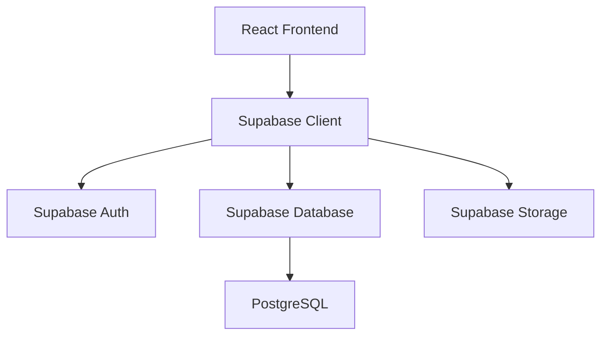
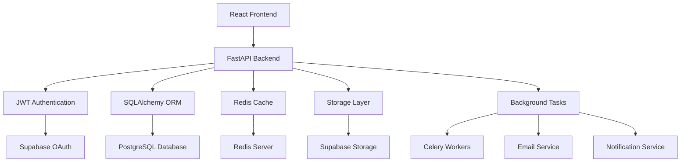
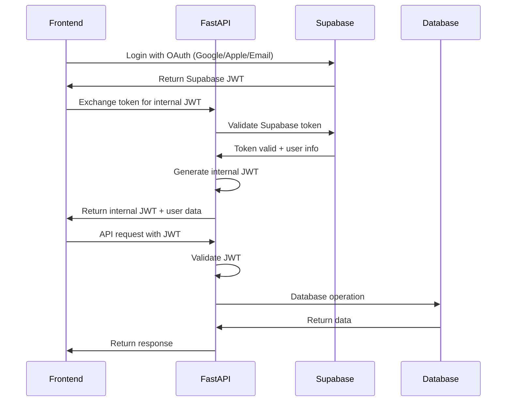

# FastAPI Architecture Overview

## 🏗️ System Architecture

### Current State (Supabase Direct)


### Target Architecture (FastAPI Backend)


## 🎯 Design Principles

### 1. **Separation of Concerns**
- **Presentation Layer**: React frontend handles UI/UX
- **API Layer**: FastAPI handles business logic and data validation
- **Data Layer**: PostgreSQL with SQLAlchemy ORM
- **Auth Layer**: JWT tokens with Supabase OAuth integration

### 2. **Security-First Approach**
- All endpoints require authentication
- Input validation using Pydantic models
- SQL injection prevention via ORM
- Rate limiting and request throttling
- Comprehensive audit logging

### 3. **Scalability**
- Stateless API design
- Database connection pooling
- Redis caching for frequently accessed data
- Async/await patterns for I/O operations
- Horizontal scaling ready

### 4. **Maintainability**
- Clear module separation
- Comprehensive error handling
- Extensive logging and monitoring
- Type hints throughout codebase
- Automated testing strategies

## 📁 Project Structure

```
fastapi-backend/
├── app/
│   ├── __init__.py
│   ├── main.py                 # FastAPI application entry point
│   ├── config.py              # Configuration settings
│   ├── dependencies.py        # Dependency injection
│   │
│   ├── api/                   # API routes
│   │   ├── __init__.py
│   │   ├── v1/                # API version 1
│   │   │   ├── __init__.py
│   │   │   ├── auth.py        # Authentication endpoints
│   │   │   ├── clients.py     # Client management
│   │   │   ├── matters.py     # Matter management
│   │   │   ├── billing.py     # Billing & invoicing
│   │   │   ├── documents.py   # Document management
│   │   │   └── analytics.py   # Analytics & reporting
│   │   └── dependencies.py    # Route dependencies
│   │
│   ├── core/                  # Core functionality
│   │   ├── __init__.py
│   │   ├── auth.py           # JWT handling
│   │   ├── security.py       # Security utilities
│   │   ├── config.py         # App configuration
│   │   └── logging.py        # Logging configuration
│   │
│   ├── models/               # SQLAlchemy models
│   │   ├── __init__.py
│   │   ├── base.py          # Base model class
│   │   ├── user.py          # User model
│   │   ├── client.py        # Client model
│   │   ├── matter.py        # Matter model
│   │   ├── billing.py       # Billing models
│   │   └── document.py      # Document model
│   │
│   ├── schemas/              # Pydantic schemas
│   │   ├── __init__.py
│   │   ├── auth.py          # Auth request/response schemas
│   │   ├── client.py        # Client schemas
│   │   ├── matter.py        # Matter schemas
│   │   ├── billing.py       # Billing schemas
│   │   └── common.py        # Shared schemas
│   │
│   ├── services/             # Business logic
│   │   ├── __init__.py
│   │   ├── auth_service.py   # Authentication logic
│   │   ├── client_service.py # Client business logic
│   │   ├── matter_service.py # Matter business logic
│   │   ├── billing_service.py# Billing logic
│   │   ├── email_service.py  # Email notifications
│   │   └── storage_service.py# File storage
│   │
│   ├── utils/                # Utility functions
│   │   ├── __init__.py
│   │   ├── validators.py     # Custom validators
│   │   ├── formatters.py     # Data formatters
│   │   ├── exceptions.py     # Custom exceptions
│   │   └── helpers.py        # Helper functions
│   │
│   └── database/             # Database configuration
│       ├── __init__.py
│       ├── connection.py     # Database connection
│       ├── migrations/       # Alembic migrations
│       └── seeds/           # Database seed data
│
├── tests/                    # Test suite
│   ├── __init__.py
│   ├── conftest.py          # Pytest configuration
│   ├── test_auth.py         # Authentication tests
│   ├── test_clients.py      # Client API tests
│   ├── test_matters.py      # Matter API tests
│   └── test_billing.py      # Billing API tests
│
├── requirements/            # Dependencies
│   ├── base.txt            # Base requirements
│   ├── development.txt     # Development dependencies
│   └── production.txt      # Production dependencies
│
├── docker/                 # Docker configuration
│   ├── Dockerfile          # Application container
│   ├── docker-compose.yml  # Local development
│   └── docker-compose.prod.yml # Production setup
│
├── scripts/                # Utility scripts
│   ├── migrate.py          # Database migrations
│   ├── seed.py            # Seed database
│   └── deploy.py          # Deployment script
│
├── .env.example           # Environment variables template
├── alembic.ini           # Alembic configuration
├── pytest.ini           # Pytest configuration
└── README.md            # Project documentation
```

## 🛡️ Security Architecture

### Authentication Flow


### Security Layers

#### 1. **API Gateway Level**
- Rate limiting per user/IP
- CORS policy enforcement
- Request size limits
- DDoS protection

#### 2. **Authentication Level**
- JWT token validation
- Token expiration handling
- Refresh token rotation
- Multi-factor authentication support

#### 3. **Authorization Level**
- Role-based access control (RBAC)
- Resource-level permissions
- Scope-based API access
- Organization-level data isolation

#### 4. **Data Level**
- Input validation and sanitization
- SQL injection prevention
- XSS protection
- Data encryption at rest

## 🗄️ Database Architecture

### Core Tables Structure

```sql
-- Users and Authentication
users (
    id UUID PRIMARY KEY,
    email VARCHAR UNIQUE NOT NULL,
    password_hash VARCHAR,
    first_name VARCHAR,
    last_name VARCHAR,
    avatar_url VARCHAR,
    created_at TIMESTAMP,
    updated_at TIMESTAMP,
    is_active BOOLEAN DEFAULT true
);

-- Organizations/Firms
organizations (
    id UUID PRIMARY KEY,
    name VARCHAR NOT NULL,
    type VARCHAR, -- solo, small, medium, large, enterprise
    created_at TIMESTAMP,
    updated_at TIMESTAMP
);

-- User-Organization relationships
user_organizations (
    user_id UUID REFERENCES users(id),
    organization_id UUID REFERENCES organizations(id),
    role VARCHAR, -- admin, attorney, staff, billing
    permissions JSONB,
    created_at TIMESTAMP,
    PRIMARY KEY (user_id, organization_id)
);

-- Clients
clients (
    id UUID PRIMARY KEY,
    organization_id UUID REFERENCES organizations(id),
    name VARCHAR NOT NULL,
    type VARCHAR, -- person, company
    status VARCHAR, -- active, inactive, prospect
    created_by UUID REFERENCES users(id),
    created_at TIMESTAMP,
    updated_at TIMESTAMP
);

-- Client contact information
client_contacts (
    id UUID PRIMARY KEY,
    client_id UUID REFERENCES clients(id),
    type VARCHAR, -- email, phone, address, website
    value TEXT NOT NULL,
    label VARCHAR, -- work, home, mobile, etc.
    is_primary BOOLEAN DEFAULT false,
    created_at TIMESTAMP
);

-- Legal Matters
matters (
    id UUID PRIMARY KEY,
    client_id UUID REFERENCES clients(id),
    organization_id UUID REFERENCES organizations(id),
    title VARCHAR NOT NULL,
    description TEXT,
    status VARCHAR, -- active, closed, pending, on_hold
    priority VARCHAR, -- low, medium, high, urgent
    stage VARCHAR, -- open, discovery, trial, etc.
    practice_area VARCHAR,
    responsible_attorney_id UUID REFERENCES users(id),
    originating_attorney_id UUID REFERENCES users(id),
    date_opened DATE,
    date_closed DATE,
    created_at TIMESTAMP,
    updated_at TIMESTAMP
);

-- Billing and Invoices
invoices (
    id UUID PRIMARY KEY,
    organization_id UUID REFERENCES organizations(id),
    client_id UUID REFERENCES clients(id),
    matter_id UUID REFERENCES matters(id),
    invoice_number VARCHAR UNIQUE,
    amount DECIMAL(10,2),
    status VARCHAR, -- draft, sent, paid, overdue
    due_date DATE,
    created_at TIMESTAMP,
    updated_at TIMESTAMP
);

-- Time Tracking
time_entries (
    id UUID PRIMARY KEY,
    matter_id UUID REFERENCES matters(id),
    user_id UUID REFERENCES users(id),
    description TEXT,
    hours DECIMAL(4,2),
    rate DECIMAL(8,2),
    billable BOOLEAN DEFAULT true,
    date_worked DATE,
    created_at TIMESTAMP
);

-- Documents
documents (
    id UUID PRIMARY KEY,
    organization_id UUID REFERENCES organizations(id),
    client_id UUID REFERENCES clients(id),
    matter_id UUID REFERENCES matters(id),
    filename VARCHAR NOT NULL,
    file_path VARCHAR NOT NULL,
    file_size INTEGER,
    mime_type VARCHAR,
    uploaded_by UUID REFERENCES users(id),
    created_at TIMESTAMP
);

-- Activity Logs (Audit Trail)
activity_logs (
    id UUID PRIMARY KEY,
    organization_id UUID REFERENCES organizations(id),
    user_id UUID REFERENCES users(id),
    action VARCHAR NOT NULL,
    resource_type VARCHAR,
    resource_id UUID,
    details JSONB,
    ip_address INET,
    user_agent TEXT,
    created_at TIMESTAMP
);
```

### Indexing Strategy

```sql
-- Performance indexes
CREATE INDEX idx_clients_org_status ON clients(organization_id, status);
CREATE INDEX idx_matters_client_status ON matters(client_id, status);
CREATE INDEX idx_invoices_client_status ON invoices(client_id, status);
CREATE INDEX idx_time_entries_matter_date ON time_entries(matter_id, date_worked);
CREATE INDEX idx_documents_matter ON documents(matter_id);
CREATE INDEX idx_activity_logs_org_date ON activity_logs(organization_id, created_at);

-- Full-text search indexes
CREATE INDEX idx_clients_search ON clients USING gin(to_tsvector('english', name));
CREATE INDEX idx_matters_search ON matters USING gin(to_tsvector('english', title || ' ' || description));
```

## 🚀 Performance Architecture

### Caching Strategy

#### 1. **Redis Cache Layers**
```python
# User session cache (TTL: 1 hour)
user_session:{user_id} -> user_data

# Client data cache (TTL: 15 minutes)
client:{client_id} -> client_full_data
clients:org:{org_id}:active -> [client_ids]

# Matter data cache (TTL: 10 minutes)
matter:{matter_id} -> matter_data
matters:client:{client_id} -> [matter_ids]

# Statistics cache (TTL: 5 minutes)
stats:dashboard:{org_id} -> dashboard_metrics
stats:billing:{org_id}:{month} -> billing_summary
```

#### 2. **Database Connection Pooling**
```python
# SQLAlchemy connection pool configuration
engine = create_engine(
    DATABASE_URL,
    pool_size=20,
    max_overflow=30,
    pool_pre_ping=True,
    pool_recycle=3600
)
```

#### 3. **Query Optimization**
- Use database indexes for common queries
- Implement pagination for large datasets
- Use eager loading for related data
- Cache frequently accessed static data

### Async/Await Patterns

```python
# Async route handlers
@router.get("/clients/{client_id}")
async def get_client(
    client_id: UUID,
    db: AsyncSession = Depends(get_db),
    current_user: User = Depends(get_current_user)
):
    # Async database operation
    client = await client_service.get_client(db, client_id)
    return client

# Async service layer
class ClientService:
    async def get_client(self, db: AsyncSession, client_id: UUID) -> Client:
        # Async database query
        result = await db.execute(
            select(Client).where(Client.id == client_id)
        )
        return result.scalar_one_or_none()
```

## 🔄 Background Tasks

### Celery Task Queue

```python
# Background task examples
@celery_app.task
def send_invoice_email(invoice_id: str):
    """Send invoice email to client"""
    pass

@celery_app.task
def generate_monthly_report(org_id: str, month: str):
    """Generate monthly billing report"""
    pass

@celery_app.task
def backup_documents(org_id: str):
    """Backup organization documents"""
    pass

@celery_app.task
def sync_calendar_events(user_id: str):
    """Sync calendar events with external calendar"""
    pass
```

## 📊 Monitoring & Observability

### Health Check Endpoints

```python
@router.get("/health")
async def health_check():
    return {
        "status": "healthy",
        "timestamp": datetime.utcnow(),
        "version": app_version
    }

@router.get("/health/detailed")
async def detailed_health_check():
    return {
        "database": await check_database_health(),
        "redis": await check_redis_health(),
        "storage": await check_storage_health(),
        "external_apis": await check_external_apis()
    }
```

### Logging Strategy

```python
# Structured logging
logger.info(
    "Client created",
    extra={
        "client_id": client.id,
        "user_id": current_user.id,
        "organization_id": current_user.organization_id,
        "action": "client_create"
    }
)
```

## 🚢 Deployment Architecture

### Container Strategy

```dockerfile
# Multi-stage Dockerfile
FROM python:3.11-slim as builder
# Build dependencies

FROM python:3.11-slim as runtime
# Runtime dependencies
COPY --from=builder /app /app
EXPOSE 8000
CMD ["uvicorn", "app.main:app", "--host", "0.0.0.0", "--port", "8000"]
```

### Infrastructure Components

```yaml
# docker-compose.yml (production)
version: '3.8'
services:
  api:
    image: ross-ai-api:latest
    replicas: 3
    environment:
      - DATABASE_URL=${DATABASE_URL}
      - REDIS_URL=${REDIS_URL}
    
  nginx:
    image: nginx:alpine
    ports:
      - "80:80"
      - "443:443"
    
  redis:
    image: redis:7-alpine
    
  postgres:
    image: postgres:15
```

This architecture provides a solid foundation for a scalable, secure, and maintainable legal practice management system using FastAPI.