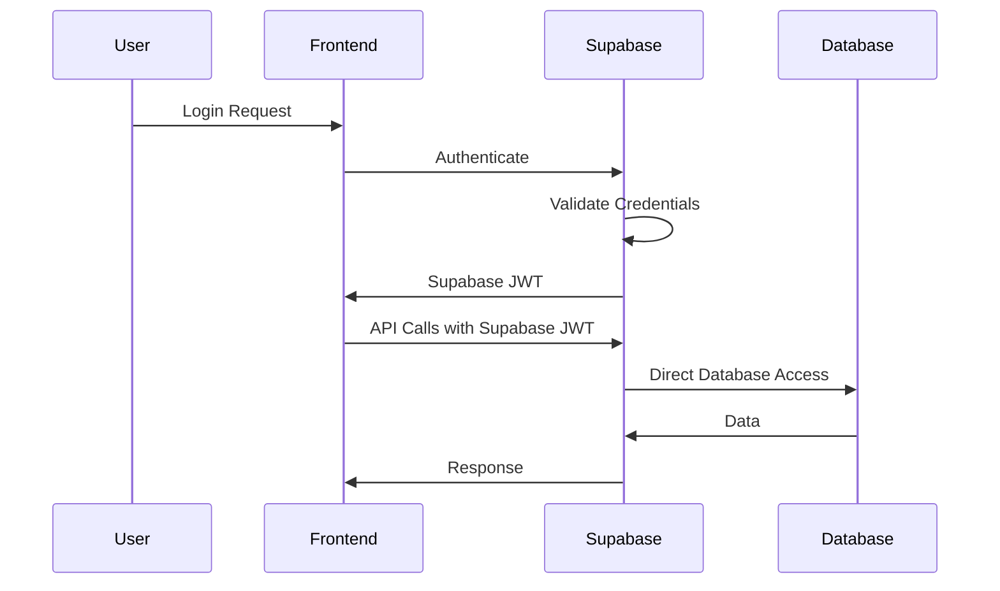
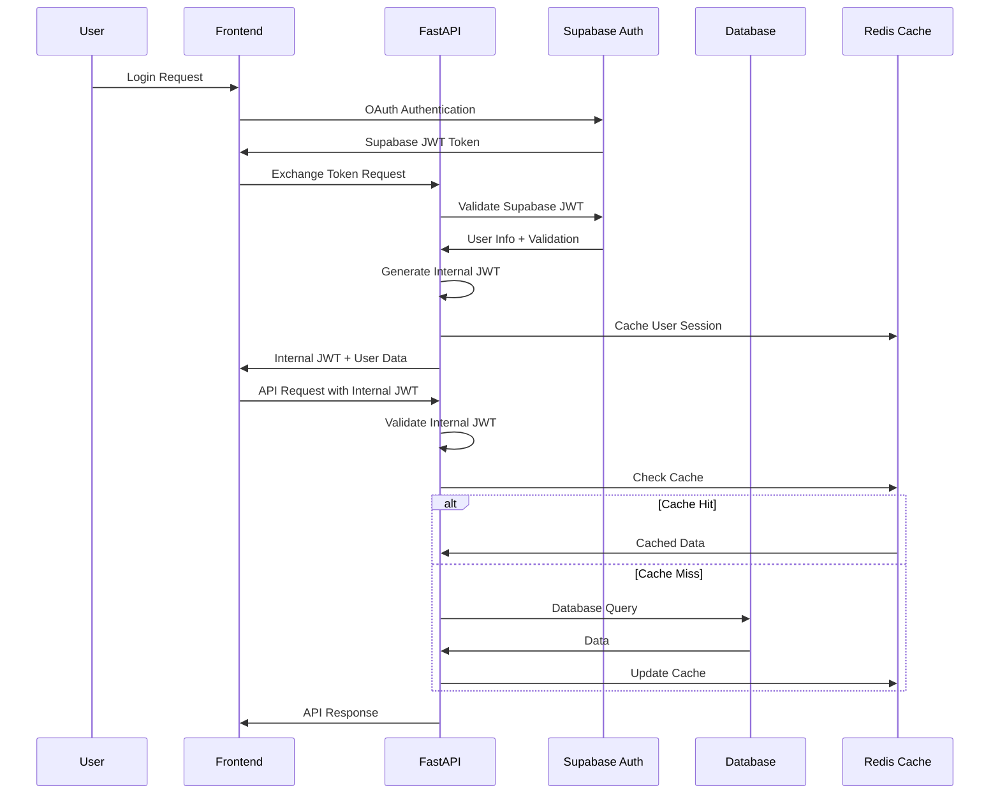
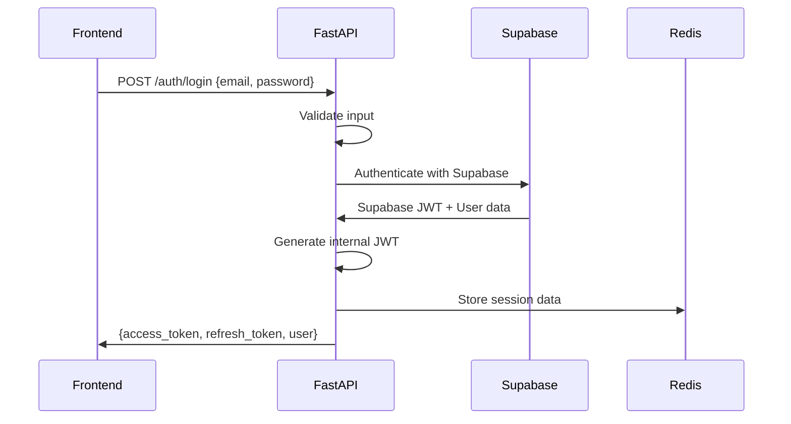
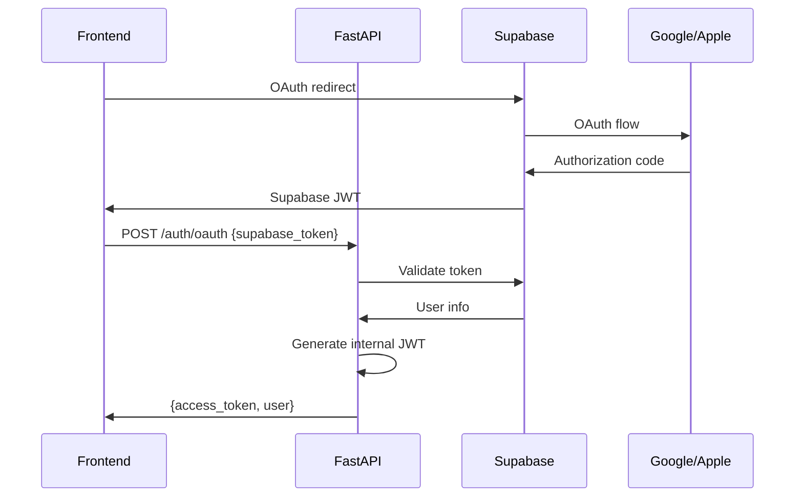
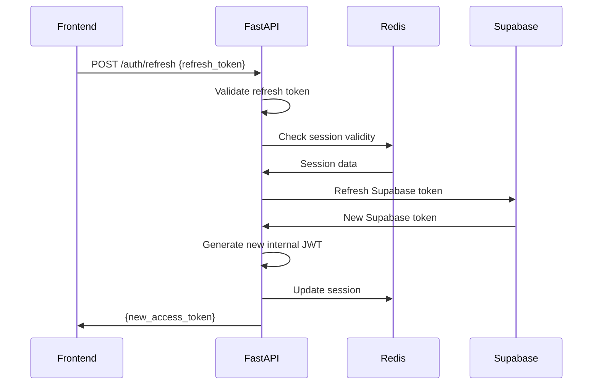
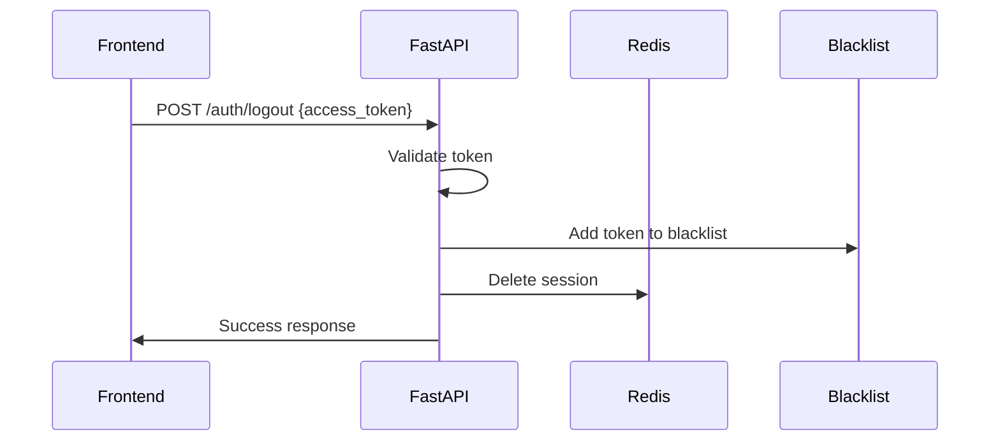

# Authentication Strategy

## 🔐 Overview

The Ross AI platform implements a hybrid authentication strategy that maintains Supabase for OAuth provider capabilities while implementing internal JWT tokens for API security. This approach provides the best of both worlds: easy OAuth integration and secure, scalable API authentication.

## 🏗️ Authentication Architecture

### Current Flow (Supabase Direct)


### Target Flow (FastAPI with JWT)


## 🎯 Authentication Strategy Components

### 1. **Supabase OAuth Integration**
- **Purpose**: Handle OAuth flows (Google, Apple, Email/Password)
- **Responsibility**: User authentication and identity verification
- **Token**: Supabase JWT (short-lived, used only for token exchange)
- **Scope**: Authentication only, no direct database access

### 2. **Internal JWT System**
- **Purpose**: Secure API communication
- **Responsibility**: Authorization and session management
- **Token**: Custom JWT with organization and role scoping
- **Scope**: All API operations and resource access

### 3. **Session Management**
- **Storage**: Redis cache for active sessions
- **TTL**: Configurable session timeout (default: 24 hours)
- **Refresh**: Automatic token refresh with Supabase
- **Invalidation**: Proper logout and token blacklisting

## 🔑 JWT Token Structure

### Internal JWT Payload
```json
{
  "sub": "user_id_uuid",           // Subject (User ID)
  "iss": "ross-ai-api",           // Issuer
  "aud": "ross-ai-frontend",      // Audience
  "exp": 1673123456,              // Expiration timestamp
  "iat": 1673120000,              // Issued at timestamp
  "jti": "token_unique_id",       // JWT ID (for blacklisting)
  
  // Custom claims
  "user": {
    "id": "user_id_uuid",
    "email": "user@example.com",
    "first_name": "John",
    "last_name": "Doe",
    "avatar_url": "https://...",
    "email_verified": true
  },
  
  "organization": {
    "id": "org_id_uuid",
    "name": "Law Firm LLP",
    "type": "small",              // solo, small, medium, large, enterprise
    "role": "attorney",           // admin, attorney, staff, billing
    "permissions": [
      "clients:read",
      "clients:write",
      "matters:read",
      "matters:write",
      "billing:read"
    ]
  },
  
  "session": {
    "id": "session_id",
    "ip_address": "192.168.1.1",
    "user_agent": "Mozilla/5.0...",
    "refresh_token": "refresh_token_hash"
  }
}
```

### Token Security Features
- **Algorithm**: RS256 (RSA signature with SHA-256)
- **Key Rotation**: Automatic key rotation every 30 days
- **Blacklisting**: Redis-based token blacklist for logout/revocation
- **Scope Validation**: Permission-based access control
- **Organization Isolation**: Multi-tenant data separation

## 🛡️ Security Implementation

### Password Security
```python
# Password hashing configuration
from passlib.context import CryptContext

pwd_context = CryptContext(
    schemes=["bcrypt"],
    deprecated="auto",
    bcrypt__rounds=12  # High security rounds
)

def hash_password(password: str) -> str:
    return pwd_context.hash(password)

def verify_password(plain_password: str, hashed_password: str) -> bool:
    return pwd_context.verify(plain_password, hashed_password)
```

### JWT Configuration
```python
import jwt
from cryptography.hazmat.primitives import serialization
from cryptography.hazmat.primitives.asymmetric import rsa

# JWT Settings
JWT_ALGORITHM = "RS256"
JWT_EXPIRATION_HOURS = 24
JWT_REFRESH_HOURS = 24 * 7  # 7 days

# Key generation (for production, use proper key management)
private_key = rsa.generate_private_key(
    public_exponent=65537,
    key_size=2048,
)

public_key = private_key.public_key()

def create_access_token(data: dict) -> str:
    to_encode = data.copy()
    expire = datetime.utcnow() + timedelta(hours=JWT_EXPIRATION_HOURS)
    to_encode.update({"exp": expire})
    
    return jwt.encode(
        to_encode, 
        private_key, 
        algorithm=JWT_ALGORITHM
    )

def verify_token(token: str) -> dict:
    try:
        payload = jwt.decode(
            token, 
            public_key, 
            algorithms=[JWT_ALGORITHM]
        )
        return payload
    except jwt.ExpiredSignatureError:
        raise HTTPException(401, "Token expired")
    except jwt.JWTError:
        raise HTTPException(401, "Invalid token")
```

### Rate Limiting
```python
from slowapi import Limiter, _rate_limit_exceeded_handler
from slowapi.util import get_remote_address

limiter = Limiter(key_func=get_remote_address)

# Authentication endpoints rate limiting
@limiter.limit("5/minute")  # 5 attempts per minute
async def login_endpoint():
    pass

@limiter.limit("3/minute")  # 3 attempts per minute
async def password_reset():
    pass

@limiter.limit("100/hour")  # General API rate limit
async def api_endpoints():
    pass
```

## 🔄 Authentication Flows

### 1. **Email/Password Login**


**Endpoint Implementation:**
```python
@router.post("/auth/login", response_model=AuthResponse)
async def login(
    credentials: LoginRequest,
    db: AsyncSession = Depends(get_db),
    redis: Redis = Depends(get_redis)
):
    # Authenticate with Supabase
    supabase_response = await authenticate_with_supabase(
        credentials.email, 
        credentials.password
    )
    
    # Get or create user in our database
    user = await get_or_create_user(db, supabase_response.user)
    
    # Generate internal tokens
    access_token = create_access_token({
        "sub": str(user.id),
        "user": user.dict(),
        "organization": user.organization.dict() if user.organization else None
    })
    
    refresh_token = create_refresh_token(user.id)
    
    # Store session in Redis
    session_data = {
        "user_id": str(user.id),
        "access_token": access_token,
        "refresh_token": refresh_token,
        "created_at": datetime.utcnow().isoformat()
    }
    
    await redis.setex(
        f"session:{user.id}",
        timedelta(hours=JWT_EXPIRATION_HOURS),
        json.dumps(session_data)
    )
    
    return AuthResponse(
        access_token=access_token,
        refresh_token=refresh_token,
        token_type="bearer",
        expires_in=JWT_EXPIRATION_HOURS * 3600,
        user=user
    )
```

### 2. **OAuth Login (Google/Apple)**


### 3. **Token Refresh**


### 4. **Logout**


## 🎯 Authorization & Permissions

### Role-Based Access Control (RBAC)

#### Organization Roles
```python
class OrganizationRole(str, Enum):
    ADMIN = "admin"           # Full organization access
    ATTORNEY = "attorney"     # Legal work and client management
    STAFF = "staff"          # Limited client and matter access
    BILLING = "billing"      # Billing and financial access
    READ_ONLY = "read_only"  # View-only access
```

#### Permission System
```python
class Permission(str, Enum):
    # Client permissions
    CLIENTS_READ = "clients:read"
    CLIENTS_WRITE = "clients:write"
    CLIENTS_DELETE = "clients:delete"
    
    # Matter permissions
    MATTERS_READ = "matters:read"
    MATTERS_WRITE = "matters:write"
    MATTERS_DELETE = "matters:delete"
    
    # Billing permissions
    BILLING_READ = "billing:read"
    BILLING_WRITE = "billing:write"
    BILLING_ADMIN = "billing:admin"
    
    # User management
    USERS_READ = "users:read"
    USERS_WRITE = "users:write"
    USERS_ADMIN = "users:admin"
    
    # System administration
    ADMIN_SETTINGS = "admin:settings"
    ADMIN_LOGS = "admin:logs"

# Role to permissions mapping
ROLE_PERMISSIONS = {
    OrganizationRole.ADMIN: [
        Permission.CLIENTS_READ, Permission.CLIENTS_WRITE, Permission.CLIENTS_DELETE,
        Permission.MATTERS_READ, Permission.MATTERS_WRITE, Permission.MATTERS_DELETE,
        Permission.BILLING_READ, Permission.BILLING_WRITE, Permission.BILLING_ADMIN,
        Permission.USERS_READ, Permission.USERS_WRITE, Permission.USERS_ADMIN,
        Permission.ADMIN_SETTINGS, Permission.ADMIN_LOGS
    ],
    OrganizationRole.ATTORNEY: [
        Permission.CLIENTS_READ, Permission.CLIENTS_WRITE,
        Permission.MATTERS_READ, Permission.MATTERS_WRITE,
        Permission.BILLING_READ, Permission.BILLING_WRITE
    ],
    OrganizationRole.STAFF: [
        Permission.CLIENTS_READ,
        Permission.MATTERS_READ,
        Permission.BILLING_READ
    ],
    OrganizationRole.BILLING: [
        Permission.CLIENTS_READ,
        Permission.BILLING_READ, Permission.BILLING_WRITE, Permission.BILLING_ADMIN
    ],
    OrganizationRole.READ_ONLY: [
        Permission.CLIENTS_READ,
        Permission.MATTERS_READ,
        Permission.BILLING_READ
    ]
}
```

### Permission Enforcement
```python
from functools import wraps

def require_permission(permission: Permission):
    def decorator(func):
        @wraps(func)
        async def wrapper(*args, **kwargs):
            current_user = kwargs.get("current_user")
            if not current_user:
                raise HTTPException(401, "Authentication required")
            
            user_permissions = current_user.organization.permissions
            if permission not in user_permissions:
                raise HTTPException(403, f"Permission denied: {permission}")
            
            return await func(*args, **kwargs)
        return wrapper
    return decorator

# Usage example
@router.post("/clients")
@require_permission(Permission.CLIENTS_WRITE)
async def create_client(
    client_data: ClientCreateRequest,
    current_user: User = Depends(get_current_user)
):
    # Implementation
    pass
```

## 🔒 Security Middleware

### JWT Authentication Middleware
```python
async def get_current_user(
    token: str = Depends(oauth2_scheme),
    db: AsyncSession = Depends(get_db),
    redis: Redis = Depends(get_redis)
) -> User:
    # Verify token format and signature
    try:
        payload = verify_token(token)
    except JWTError:
        raise HTTPException(401, "Invalid token")
    
    # Check token blacklist
    token_id = payload.get("jti")
    is_blacklisted = await redis.exists(f"blacklist:{token_id}")
    if is_blacklisted:
        raise HTTPException(401, "Token revoked")
    
    # Get user from database
    user_id = payload.get("sub")
    user = await get_user_by_id(db, user_id)
    if not user or not user.is_active:
        raise HTTPException(401, "User not found or inactive")
    
    # Validate organization access
    org_id = payload.get("organization", {}).get("id")
    if org_id and str(user.organization_id) != org_id:
        raise HTTPException(401, "Organization mismatch")
    
    return user
```

### Organization Isolation Middleware
```python
async def get_organization_filter(
    current_user: User = Depends(get_current_user)
) -> UUID:
    """Ensure all database queries are filtered by organization"""
    if not current_user.organization_id:
        raise HTTPException(403, "No organization access")
    
    return current_user.organization_id

# Usage in database queries
async def get_clients(
    db: AsyncSession,
    org_id: UUID = Depends(get_organization_filter)
) -> List[Client]:
    result = await db.execute(
        select(Client)
        .where(Client.organization_id == org_id)
        .where(Client.is_active == True)
    )
    return result.scalars().all()
```

## 📱 Multi-Factor Authentication (Future Enhancement)

### TOTP Implementation
```python
import pyotp
from qrcode import QRCode

class MFAService:
    @staticmethod
    def generate_secret() -> str:
        return pyotp.random_base32()
    
    @staticmethod
    def generate_qr_code(user_email: str, secret: str) -> str:
        totp_uri = pyotp.totp.TOTP(secret).provisioning_uri(
            user_email,
            issuer_name="Ross AI"
        )
        
        qr = QRCode(version=1, box_size=10, border=5)
        qr.add_data(totp_uri)
        qr.make(fit=True)
        
        # Return base64 encoded QR code image
        return generate_qr_image(qr)
    
    @staticmethod
    def verify_totp(secret: str, token: str) -> bool:
        totp = pyotp.TOTP(secret)
        return totp.verify(token, valid_window=1)
```

## 🔧 Environment Configuration

### Authentication Settings
```python
# settings.py
from pydantic import BaseSettings

class AuthSettings(BaseSettings):
    # JWT Configuration
    JWT_SECRET_KEY: str
    JWT_ALGORITHM: str = "RS256"
    JWT_EXPIRATION_HOURS: int = 24
    JWT_REFRESH_HOURS: int = 168  # 7 days
    
    # Supabase Configuration
    SUPABASE_URL: str
    SUPABASE_ANON_KEY: str
    SUPABASE_SERVICE_ROLE_KEY: str
    
    # Security Settings
    PASSWORD_MIN_LENGTH: int = 8
    PASSWORD_REQUIRE_UPPERCASE: bool = True
    PASSWORD_REQUIRE_LOWERCASE: bool = True
    PASSWORD_REQUIRE_NUMBERS: bool = True
    PASSWORD_REQUIRE_SPECIAL: bool = True
    
    # Rate Limiting
    LOGIN_RATE_LIMIT: str = "5/minute"
    API_RATE_LIMIT: str = "1000/hour"
    
    # Session Settings
    SESSION_TIMEOUT_HOURS: int = 24
    REMEMBER_ME_DAYS: int = 30
    
    class Config:
        env_file = ".env"
```

This authentication strategy provides a robust, secure, and scalable foundation for the Ross AI platform while maintaining the ease of use provided by Supabase OAuth integration.