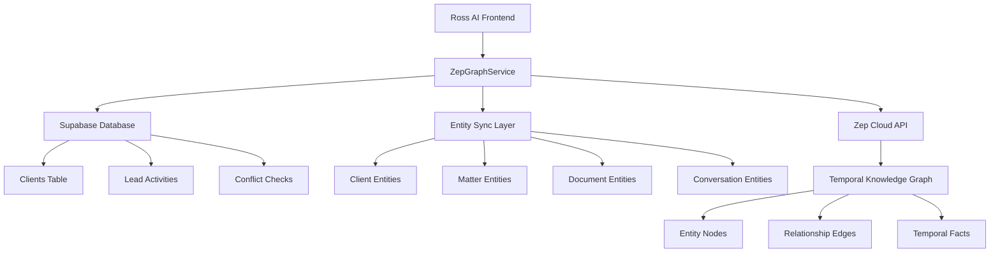

# Zep Integration Plan for Ross AI Legal Practice Management

## Table of Contents
- [Executive Summary](#executive-summary)
- [Current System Analysis](#current-system-analysis)
- [Zep Integration Architecture](#zep-integration-architecture)
- [Entity Model Design](#entity-model-design)
- [Relationship Mapping](#relationship-mapping)
- [Migration Strategy](#migration-strategy)
- [Implementation Guide](#implementation-guide)
- [Code Examples](#code-examples)
- [Benefits & Impact](#benefits--impact)
- [Timeline & Phases](#timeline--phases)

## Executive Summary

This document outlines a comprehensive plan to integrate Zep's temporal knowledge graph into the Ross AI legal practice management system. The integration will transform the current fragmented data storage approach into a unified, AI-powered knowledge system that tracks legal relationships over time.

### Key Goals
- **Unify Data Architecture**: Replace localStorage-based conversations and local workflows with Zep's temporal graph
- **Enhance AI Context**: Provide richer context for AI-powered legal assistance
- **Enable Temporal Analytics**: Track how legal relationships evolve over time
- **Improve User Experience**: Deliver more intelligent, context-aware features

## Current System Analysis

### Existing Architecture
The Ross AI system currently uses a hybrid data storage approach:

#### Data Storage Layers
1. **Supabase Database** (PostgreSQL)
   - Client data with lead management
   - Lead activities and conflict checks
   - Intake workflows and templates
   - Authentication and user profiles

2. **Local Storage** (Browser)
   - AI conversations and chat history
   - Workflow executions and templates
   - UI state and preferences

3. **File System** (Supabase Storage)
   - Document storage and management
   - Client photos and attachments

### Current Entity Types

#### Client Entity (Supabase)
```sql
CREATE TABLE public.clients (
  id UUID PRIMARY KEY,
  user_id UUID REFERENCES auth.users(id),
  name TEXT NOT NULL,
  email TEXT,
  phone TEXT,
  client_type TEXT CHECK (client_type IN ('person', 'company')),
  lead_status TEXT CHECK (lead_status IN ('prospect', 'qualified', 'consultation', 'proposal', 'converted', 'lost')),
  intake_stage TEXT CHECK (intake_stage IN ('initial', 'qualification', 'conflict_check', 'consultation', 'proposal', 'onboarding', 'completed')),
  industry TEXT,
  lead_score INTEGER,
  -- ... additional fields
);
```

#### Document Entity (TypeScript)
```typescript
interface Document {
  id: string;
  name: string;
  type: DocumentType;
  category: DocumentCategory; // 25+ legal document categories
  subtype?: DocumentSubtype;
  status: DocumentStatus;
  matterId?: string;
  clientId?: string;
  aiAnalysis?: AIAnalysis;
  // ... additional fields
}
```

#### Conversation Entity (localStorage)
```typescript
interface Conversation {
  id: string;
  title: string;
  category: ConversationCategory;
  contextType?: 'matter' | 'client';
  contextId?: string;
  messages: ChatMessage[];
  workflowTemplateId?: string;
  // ... additional fields
}
```

### Current Limitations

1. **Data Fragmentation**: Related information scattered across different storage systems
2. **No Temporal Tracking**: Limited ability to track how relationships change over time
3. **Weak AI Context**: AI lacks comprehensive context about legal relationships
4. **Manual Relationship Management**: Relationships between entities maintained manually
5. **Limited Analytics**: Difficult to perform complex queries across related data

## Zep Integration Architecture

### High-Level Design



### Core Components

#### 1. ZepGraphService
Central service managing all Zep interactions and data synchronization.

#### 2. Entity Sync Layer
Bi-directional synchronization between Supabase and Zep entities.

#### 3. Temporal Relationship Engine
Tracks how legal relationships evolve over time.

#### 4. AI Context Builder
Constructs rich context for AI assistants using graph data.

## Entity Model Design

### Client Entity (Zep)
```typescript
interface ZepClientEntity {
  // Core identification
  name: string;
  client_type: 'person' | 'company';
  email?: string;
  phone?: string;
  
  // Legal status
  lead_status: 'prospect' | 'qualified' | 'consultation' | 'proposal' | 'converted' | 'lost';
  intake_stage: 'initial' | 'qualification' | 'conflict_check' | 'consultation' | 'proposal' | 'onboarding' | 'completed';
  
  // Business context
  industry?: string;
  company_name?: string;
  
  // Scoring and assignment
  lead_score?: number; // 0-100
  assigned_attorney_id?: string;
  referral_source?: string;
  
  // Geographic
  jurisdiction?: string;
  state?: string;
  country?: string;
}
```

### Matter Entity (Zep)
```typescript
interface ZepMatterEntity {
  // Core identification
  title: string;
  matter_number?: string;
  description: string;
  
  // Legal classification
  practice_area: string;
  practice_sub_area?: string;
  matter_type: string;
  
  // Status and lifecycle
  status: 'active' | 'closed' | 'pending' | 'on_hold';
  stage: 'open' | 'discovery' | 'mediation' | 'trial' | 'settlement' | 'appeal' | 'closed';
  priority: 'low' | 'medium' | 'high' | 'urgent';
  
  // Responsibility
  responsible_attorney: string;
  responsible_attorney_id: string;
  originating_attorney?: string;
  responsible_staff: string[];
  
  // Financial
  billing_method: 'hourly' | 'flat_fee' | 'contingency' | 'retainer';
  hourly_rate?: number;
  estimated_budget?: number;
  
  // Temporal
  date_opened: string;
  date_closed?: string;
  next_action_date?: string;
  
  // Location
  court?: string;
  jurisdiction?: string;
}
```

### Document Entity (Zep)
```typescript
interface ZepDocumentEntity {
  // Core identification
  name: string;
  document_type: 'pdf' | 'docx' | 'txt' | 'image' | 'other';
  
  // Legal classification
  category: string; // From 25+ legal categories
  subtype?: string;
  practice_area?: string;
  
  // AI analysis
  ai_risk_score?: number; // 0-100
  ai_confidence?: number; // 0-1
  ai_summary?: string;
  
  // Legal metadata
  jurisdiction?: string;
  court?: string;
  filing_date?: string;
  
  // Content analysis
  page_count?: number;
  word_count?: number;
  language?: string;
  
  // Status
  status: 'active' | 'archived' | 'draft';
  version: number;
}
```

### Attorney Entity (Zep)
```typescript
interface ZepAttorneyEntity {
  // Core identification
  name: string;
  email: string;
  bar_number?: string;
  
  // Professional
  practice_areas: string[];
  jurisdiction: string[];
  years_experience?: number;
  
  // Firm context
  role: 'partner' | 'associate' | 'of_counsel' | 'paralegal' | 'staff';
  department?: string;
  
  // Specializations
  certifications: string[];
  languages: string[];
}
```

### OpposingParty Entity (Zep)
```typescript
interface ZepOpposingPartyEntity {
  // Core identification
  name: string;
  party_type: 'individual' | 'company' | 'government' | 'organization';
  
  // Legal representation
  attorney_name?: string;
  law_firm?: string;
  
  // Role context
  role: 'defendant' | 'plaintiff' | 'respondent' | 'petitioner' | 'third_party';
  
  // Contact
  address?: string;
  phone?: string;
  email?: string;
}
```

## Relationship Mapping

### Core Relationships

#### Attorney-Client Relationships
```typescript
interface AttorneyClientEdge {
  relationship_type: 'REPRESENTS';
  role: 'primary' | 'secondary' | 'consulting';
  start_date: string;
  end_date?: string;
  billing_rate?: number;
  matter_limit?: string[]; // Specific matters only
}
```

#### Client-Matter Relationships
```typescript
interface ClientMatterEdge {
  relationship_type: 'OWNS' | 'INVOLVES';
  role: 'plaintiff' | 'defendant' | 'client' | 'beneficiary';
  start_date: string;
  end_date?: string;
  billing_arrangement: string;
  priority: 'primary' | 'secondary';
}
```

#### Matter-Document Relationships
```typescript
interface MatterDocumentEdge {
  relationship_type: 'CONTAINS' | 'REFERENCES' | 'OPPOSES';
  document_role: 'evidence' | 'pleading' | 'motion' | 'correspondence' | 'research';
  filing_status: 'filed' | 'draft' | 'internal' | 'received';
  relevance_score?: number; // 0-1
  privilege_status: 'privileged' | 'work_product' | 'discoverable' | 'public';
}
```

#### Attorney-Matter Relationships
```typescript
interface AttorneyMatterEdge {
  relationship_type: 'HANDLES' | 'SUPERVISES' | 'ASSISTS';
  responsibility_level: 'primary' | 'secondary' | 'consulting';
  start_date: string;
  end_date?: string;
  time_allocation?: number; // Percentage of time
}
```

#### Document-Citation Relationships
```typescript
interface DocumentCitationEdge {
  relationship_type: 'CITES' | 'REFERENCES' | 'RELIES_ON';
  citation_type: 'case_law' | 'statute' | 'regulation' | 'secondary_authority';
  strength: 'primary' | 'supporting' | 'distinguishing' | 'contrary';
  page_references?: string[];
  relevance_score?: number; // 0-1
}
```

#### Conversation-Context Relationships
```typescript
interface ConversationContextEdge {
  relationship_type: 'DISCUSSES' | 'ANALYZES' | 'PLANS';
  context_type: 'client' | 'matter' | 'document' | 'strategy';
  topic_focus: string[];
  ai_extraction_confidence?: number; // 0-1
  fact_count?: number;
}
```

### Temporal Relationship Examples

#### Matter Lifecycle Tracking
```typescript
// Track how matter status changes over time
const matterStatusHistory = [
  { status: 'pending', valid_from: '2024-01-15', valid_to: '2024-01-20' },
  { status: 'active', valid_from: '2024-01-20', valid_to: '2024-06-15' },
  { status: 'settlement', valid_from: '2024-06-15', valid_to: '2024-07-01' },
  { status: 'closed', valid_from: '2024-07-01', valid_to: null }
];
```

#### Attorney Assignment Changes
```typescript
// Track attorney changes on matters
const attorneyAssignments = [
  { attorney: 'John Smith', role: 'primary', valid_from: '2024-01-15', valid_to: '2024-03-01' },
  { attorney: 'Jane Doe', role: 'primary', valid_from: '2024-03-01', valid_to: null },
  { attorney: 'John Smith', role: 'consulting', valid_from: '2024-03-01', valid_to: null }
];
```

## Migration Strategy

### Phase 1: Foundation Setup (Week 1-2)
**Goal**: Establish Zep integration foundation

#### Tasks:
1. **Install Zep SDK**
   ```bash
   npm install zep-cloud
   ```

2. **Environment Configuration**
   ```typescript
   // .env
   VITE_ZEP_API_KEY=your_zep_api_key
   VITE_ZEP_PROJECT_ID=your_project_id
   ```

3. **Create ZepGraphService**
   - Basic service structure
   - Authentication setup
   - Connection testing

4. **Update Package Dependencies**
   ```json
   {
     "dependencies": {
       "zep-cloud": "^latest",
       "@getzep/zep-cloud": "^latest"
     }
   }
   ```

#### Deliverables:
- ✅ Working Zep connection
- ✅ Basic service architecture
- ✅ Environment configuration

### Phase 2: Entity Definition (Week 3-4)
**Goal**: Define and implement custom entity types

#### Tasks:
1. **Define Custom Entity Types**
   - Client entity with legal-specific attributes
   - Matter entity with case management fields
   - Document entity with AI analysis metadata
   - Attorney entity with professional details

2. **Define Custom Edge Types**
   - Attorney-Client representation relationships
   - Client-Matter ownership relationships
   - Matter-Document containment relationships
   - Document-Citation reference relationships

3. **Entity Validation**
   - Pydantic model validation
   - Type safety implementation
   - Error handling

#### Deliverables:
- ✅ Complete entity type definitions
- ✅ Edge type mappings
- ✅ Validation schemas

### Phase 3: Data Migration (Week 5-6)
**Goal**: Migrate existing data to Zep graph

#### Tasks:
1. **Conversation Migration**
   - Extract conversations from localStorage
   - Transform to Zep episodes
   - Preserve conversation context

2. **Client Data Sync**
   - Create bi-directional sync with Supabase
   - Handle data consistency
   - Implement real-time updates

3. **Document Relationship Building**
   - Map existing document-matter relationships
   - Extract document metadata for entities

#### Deliverables:
- ✅ All conversations migrated to Zep
- ✅ Client data synchronized
- ✅ Document relationships established

### Phase 4: AI Enhancement (Week 7-8)
**Goal**: Enhance AI capabilities with graph context

#### Tasks:
1. **Context Builder Implementation**
   - Graph-based context construction
   - Temporal relationship queries
   - Fact extraction from conversations

2. **Update AI Services**
   - Replace localStorage context with Zep queries
   - Enhance prompt engineering with graph data
   - Implement fact-based responses

3. **Document AI Integration**
   - Extract legal facts from documents into graph
   - Link document analysis to matter context
   - Implement citation tracking

#### Deliverables:
- ✅ AI context enhanced with graph data
- ✅ Document AI integrated with graph
- ✅ Fact extraction working

### Phase 5: Advanced Features (Week 9-12)
**Goal**: Implement advanced graph-powered features

#### Tasks:
1. **Temporal Analytics**
   - Matter timeline visualization
   - Client relationship history
   - Attorney workload analysis

2. **Intelligent Suggestions**
   - Related case identification
   - Document recommendation engine
   - Conflict detection automation

3. **Advanced Queries**
   - Complex relationship traversal
   - Pattern recognition
   - Predictive analytics

#### Deliverables:
- ✅ Timeline visualizations
- ✅ Intelligent recommendation system
- ✅ Advanced analytics dashboard

## Implementation Guide

### ZepGraphService Architecture

```typescript
// services/zepGraphService.ts
import { Zep } from 'zep-cloud';
import { 
  ZepClientEntity, 
  ZepMatterEntity, 
  ZepDocumentEntity,
  AttorneyClientEdge,
  ClientMatterEdge,
  MatterDocumentEdge 
} from '@/types/zep';

export class ZepGraphService {
  private zep: Zep;
  private userId: string;

  constructor() {
    this.zep = new Zep({
      apiKey: import.meta.env.VITE_ZEP_API_KEY,
    });
  }

  // ============================================================================
  // CONVERSATION MANAGEMENT (Replaces conversationService.ts localStorage)
  // ============================================================================

  /**
   * Create a new conversation in Zep graph
   * Replaces localStorage-based conversation creation
   */
  async createConversation(
    title: string,
    category: string,
    contextType?: 'client' | 'matter',
    contextId?: string,
    contextName?: string
  ): Promise<string> {
    const sessionId = this.generateSessionId();
    
    // Create session with metadata
    await this.zep.user.addSession({
      userId: this.getCurrentUserId(),
      sessionId,
      metadata: {
        title,
        category,
        contextType,
        contextId,
        contextName,
        createdAt: new Date().toISOString()
      }
    });

    return sessionId;
  }

  /**
   * Add message to conversation with fact extraction
   */
  async addMessage(
    sessionId: string,
    content: string,
    role: 'user' | 'assistant',
    extractFacts: boolean = true
  ): Promise<void> {
    await this.zep.memory.addMemory({
      sessionId,
      messages: [{
        role,
        content,
        metadata: {
          timestamp: new Date().toISOString(),
          extractFacts
        }
      }]
    });

    // If this is about a specific matter/client, extract legal facts
    if (extractFacts && role === 'user') {
      await this.extractLegalFacts(sessionId, content);
    }
  }

  /**
   * Get conversation history with context
   */
  async getConversation(sessionId: string): Promise<any> {
    const memory = await this.zep.memory.getMemory({
      sessionId,
      lastn: 50
    });

    return {
      id: sessionId,
      messages: memory.messages || [],
      summary: memory.summary,
      context: memory.metadata
    };
  }

  // ============================================================================
  // ENTITY MANAGEMENT
  // ============================================================================

  /**
   * Sync client from Supabase to Zep
   */
  async syncClient(client: any): Promise<void> {
    const entityData: ZepClientEntity = {
      name: client.name,
      client_type: client.client_type,
      email: client.email,
      phone: client.phone,
      lead_status: client.lead_status,
      intake_stage: client.intake_stage,
      industry: client.industry,
      lead_score: client.lead_score,
      assigned_attorney_id: client.assigned_attorney_id,
      referral_source: client.referral_source,
      state: client.state,
      country: client.country || 'US'
    };

    await this.zep.graph.add({
      episodes: [{
        event: `Client ${client.name} updated`,
        timestamp: new Date().toISOString(),
        entityTypes: {
          Client: entityData
        }
      }]
    });
  }

  /**
   * Create matter entity and link to client
   */
  async createMatter(
    matter: any,
    clientId: string
  ): Promise<void> {
    const matterEntity: ZepMatterEntity = {
      title: matter.title,
      matter_number: matter.matterNumber,
      description: matter.description,
      practice_area: matter.practiceArea,
      practice_sub_area: matter.practiceSubArea,
      matter_type: matter.practiceArea, // Could be more specific
      status: matter.status,
      stage: matter.stage,
      priority: matter.priority,
      responsible_attorney: matter.responsibleAttorney,
      responsible_attorney_id: matter.responsibleAttorneyId,
      originating_attorney: matter.originatingAttorney,
      responsible_staff: matter.responsibleStaff,
      billing_method: matter.billingPreference.method,
      hourly_rate: matter.billingPreference.hourlyRate,
      estimated_budget: matter.estimatedBudget,
      date_opened: matter.dateOpened,
      date_closed: matter.dateClosed,
      next_action_date: matter.nextActionDate,
      court: matter.customFields?.court,
      jurisdiction: matter.customFields?.jurisdiction
    };

    const clientMatterEdge: ClientMatterEdge = {
      relationship_type: 'OWNS',
      role: 'client',
      start_date: matter.dateOpened,
      billing_arrangement: matter.billingPreference.method,
      priority: 'primary'
    };

    await this.zep.graph.add({
      episodes: [{
        event: `Matter ${matter.title} created for client`,
        timestamp: new Date().toISOString(),
        entityTypes: {
          Matter: matterEntity
        },
        edgeTypes: {
          ClientMatterRelation: {
            source: 'Client',
            target: 'Matter',
            ...clientMatterEdge
          }
        }
      }]
    });
  }

  /**
   * Add document to matter with AI analysis
   */
  async addDocumentToMatter(
    document: any,
    matterId: string,
    aiAnalysis?: any
  ): Promise<void> {
    const documentEntity: ZepDocumentEntity = {
      name: document.name,
      document_type: document.type,
      category: document.category,
      subtype: document.subtype,
      practice_area: document.metadata?.practiceArea,
      ai_risk_score: aiAnalysis?.riskScore,
      ai_confidence: aiAnalysis?.confidence,
      ai_summary: aiAnalysis?.summary,
      jurisdiction: document.metadata?.jurisdiction,
      court: document.metadata?.court,
      filing_date: document.metadata?.filingDate,
      page_count: document.metadata?.pageCount,
      word_count: document.metadata?.wordCount,
      language: document.metadata?.language,
      status: document.status,
      version: document.version
    };

    const matterDocumentEdge: MatterDocumentEdge = {
      relationship_type: 'CONTAINS',
      document_role: this.inferDocumentRole(document.category),
      filing_status: document.status === 'active' ? 'filed' : 'draft',
      relevance_score: aiAnalysis?.confidence,
      privilege_status: this.inferPrivilegeStatus(document.category)
    };

    await this.zep.graph.add({
      episodes: [{
        event: `Document ${document.name} added to matter`,
        timestamp: new Date().toISOString(),
        entityTypes: {
          Document: documentEntity
        },
        edgeTypes: {
          MatterDocumentRelation: {
            source: 'Matter',
            target: 'Document',
            ...matterDocumentEdge
          }
        }
      }]
    });

    // Extract and add legal facts from document if AI analysis is available
    if (aiAnalysis?.findings) {
      await this.extractDocumentFacts(document.id, aiAnalysis);
    }
  }

  // ============================================================================
  // CONTEXT BUILDING FOR AI
  // ============================================================================

  /**
   * Build comprehensive AI context for a conversation
   */
  async buildAIContext(
    sessionId: string,
    contextType?: 'client' | 'matter',
    contextId?: string
  ): Promise<string> {
    const searchResults = await this.zep.graph.search({
      query: `context for ${contextType} ${contextId}`,
      searchType: 'similarity',
      nodeTypes: ['Client', 'Matter', 'Document', 'Attorney'],
      edgeTypes: ['REPRESENTS', 'OWNS', 'CONTAINS', 'HANDLES']
    });

    let context = "# Legal Context\n\n";

    // Add entity context
    if (searchResults.nodes) {
      context += "## Relevant Entities\n";
      searchResults.nodes.forEach(node => {
        context += `- **${node.name}** (${node.nodeType}): ${node.summary}\n`;
      });
    }

    // Add relationship context
    if (searchResults.edges) {
      context += "\n## Relevant Relationships\n";
      searchResults.edges.forEach(edge => {
        context += `- **${edge.fact}** (${edge.validFrom} - ${edge.validTo || 'present'})\n`;
      });
    }

    // Add recent conversation context
    const memory = await this.zep.memory.getMemory({
      sessionId,
      lastn: 10
    });

    if (memory.summary) {
      context += `\n## Conversation Summary\n${memory.summary}\n`;
    }

    return context;
  }

  /**
   * Get client timeline with all related activities
   */
  async getClientTimeline(clientId: string): Promise<any[]> {
    const searchResults = await this.zep.graph.search({
      query: `timeline for client ${clientId}`,
      searchType: 'temporal',
      nodeTypes: ['Client', 'Matter', 'Document', 'Activity'],
      edgeTypes: ['OWNS', 'CONTAINS', 'INVOLVES']
    });

    // Sort by temporal validity and create timeline
    const timeline = [];
    
    if (searchResults.edges) {
      searchResults.edges
        .sort((a, b) => new Date(a.validFrom).getTime() - new Date(b.validFrom).getTime())
        .forEach(edge => {
          timeline.push({
            date: edge.validFrom,
            type: 'relationship',
            description: edge.fact,
            entity: edge.source,
            target: edge.target
          });
        });
    }

    return timeline;
  }

  /**
   * Find related matters based on similar fact patterns
   */
  async findRelatedMatters(
    currentMatterId: string,
    factPattern: string
  ): Promise<any[]> {
    const searchResults = await this.zep.graph.search({
      query: factPattern,
      searchType: 'similarity',
      nodeTypes: ['Matter'],
      edgeTypes: ['CONTAINS', 'INVOLVES'],
      filters: {
        nodeId: { not: currentMatterId }
      }
    });

    return searchResults.nodes?.map(node => ({
      id: node.nodeId,
      title: node.name,
      similarity: node.score,
      practiceArea: node.attributes?.practice_area,
      status: node.attributes?.status
    })) || [];
  }

  // ============================================================================
  // PRIVATE HELPER METHODS
  // ============================================================================

  private async extractLegalFacts(sessionId: string, content: string): Promise<void> {
    // Use AI to extract legal facts from conversation content
    // This would integrate with your existing Claude API service
    try {
      const facts = await this.extractFactsFromText(content);
      
      for (const fact of facts) {
        await this.zep.graph.add({
          episodes: [{
            event: `Legal fact extracted: ${fact.summary}`,
            timestamp: new Date().toISOString(),
            entityTypes: {
              LegalFact: {
                fact_type: fact.type,
                summary: fact.summary,
                confidence: fact.confidence,
                source: 'conversation',
                session_id: sessionId
              }
            }
          }]
        });
      }
    } catch (error) {
      console.error('Failed to extract legal facts:', error);
    }
  }

  private async extractDocumentFacts(documentId: string, aiAnalysis: any): Promise<void> {
    // Extract facts from AI document analysis
    for (const finding of aiAnalysis.findings) {
      await this.zep.graph.add({
        episodes: [{
          event: `Legal finding: ${finding.title}`,
          timestamp: new Date().toISOString(),
          entityTypes: {
            LegalFact: {
              fact_type: finding.type,
              summary: finding.description,
              confidence: finding.confidence,
              severity: finding.severity,
              source: 'document_analysis',
              document_id: documentId,
              page_number: finding.location?.page
            }
          }
        }]
      });
    }
  }

  private inferDocumentRole(category: string): string {
    const roleMap: Record<string, string> = {
      'pleadings': 'pleading',
      'motions': 'motion',
      'discovery': 'evidence',
      'contracts_agreements': 'contract',
      'legal_correspondence': 'correspondence',
      // ... more mappings
    };
    return roleMap[category] || 'other';
  }

  private inferPrivilegeStatus(category: string): string {
    const privilegeMap: Record<string, string> = {
      'legal_correspondence': 'privileged',
      'research': 'work_product',
      'pleadings': 'public',
      'discovery': 'discoverable',
      // ... more mappings
    };
    return privilegeMap[category] || 'discoverable';
  }

  private async extractFactsFromText(text: string): Promise<any[]> {
    // Placeholder for fact extraction logic
    // Would integrate with Claude API or other NLP service
    return [];
  }

  private generateSessionId(): string {
    return `session_${Date.now()}_${Math.random().toString(36).substr(2, 9)}`;
  }

  private getCurrentUserId(): string {
    // Get current user ID from auth context
    return 'current-user-id';
  }
}

export const zepGraphService = new ZepGraphService();
```

### Service Integration Updates

#### Update conversationService.ts
```typescript
// services/conversationService.ts
import { zepGraphService } from './zepGraphService';

class ConversationService {
  // Replace localStorage methods with Zep graph calls
  
  async createConversation(
    title: string,
    category: ConversationCategory,
    contextType?: 'matter' | 'client',
    contextId?: string,
    contextName?: string
  ): Promise<Conversation> {
    const sessionId = await zepGraphService.createConversation(
      title,
      category,
      contextType,
      contextId,
      contextName
    );

    return {
      id: sessionId,
      title,
      category,
      contextType,
      contextId,
      contextName,
      messages: [],
      createdAt: new Date().toISOString(),
      updatedAt: new Date().toISOString(),
      lastMessage: '',
      lastActivity: new Date().toISOString(),
      messageCount: 0,
      isStarred: false
    };
  }

  async addMessage(conversationId: string, message: ChatMessage): Promise<void> {
    await zepGraphService.addMessage(
      conversationId,
      message.content,
      message.role,
      true // Extract facts
    );
  }

  async getConversation(conversationId: string): Promise<Conversation | null> {
    return await zepGraphService.getConversation(conversationId);
  }

  // ... other methods updated to use Zep
}
```

#### Update clientService.ts
```typescript
// services/clientService.ts
import { zepGraphService } from './zepGraphService';

export class ClientService {
  static async createClient(clientData: NewClientData): Promise<Client> {
    // Create in Supabase (existing logic)
    const client = await this.createClientInSupabase(clientData);
    
    // Sync to Zep graph
    await zepGraphService.syncClient(client);
    
    return client;
  }

  static async updateClient(id: string, updates: Partial<Client>): Promise<Client> {
    // Update in Supabase (existing logic)
    const client = await this.updateClientInSupabase(id, updates);
    
    // Sync updates to Zep graph
    await zepGraphService.syncClient(client);
    
    return client;
  }

  // ... other methods
}
```

#### Update claudeApiService.ts
```typescript
// services/claudeApiService.ts
import { zepGraphService } from './zepGraphService';

class ClaudeApiService {
  async sendMessage(
    message: string,
    conversationId: string,
    contextType?: 'client' | 'matter',
    contextId?: string
  ): Promise<string> {
    // Build rich context from Zep graph
    const legalContext = await zepGraphService.buildAIContext(
      conversationId,
      contextType,
      contextId
    );

    const prompt = `
${legalContext}

## User Message
${message}

## Instructions
You are a legal AI assistant. Use the above context to provide accurate, helpful responses while maintaining attorney-client privilege and professional standards.
`;

    // Send to Claude API with enhanced context
    const response = await this.callClaudeAPI(prompt);
    
    // Add response to conversation
    await zepGraphService.addMessage(conversationId, response, 'assistant');
    
    return response;
  }
}
```

## Benefits & Impact

### For Legal Professionals

#### 1. **Unified Client View**
- Complete timeline of all client interactions
- Automatic relationship tracking across matters
- Historical context for better decision-making

#### 2. **Enhanced AI Assistance**
- AI with comprehensive understanding of case context
- Automatic fact extraction from documents and conversations
- Intelligent suggestions based on similar cases

#### 3. **Temporal Analytics**
- Track how cases evolve over time
- Identify patterns in successful outcomes
- Predict potential case developments

#### 4. **Improved Efficiency**
- Automated relationship management
- Reduced manual data entry
- Context-aware workflows

### For Developers

#### 1. **Simplified Architecture**
- Single source of truth for relationships
- Reduced data synchronization complexity
- Unified query interface

#### 2. **Enhanced Features**
- Rich temporal queries
- Graph-based analytics
- Intelligent recommendations

#### 3. **Scalability**
- Built-in scaling with Zep Cloud
- Optimized graph queries
- Efficient data storage

### For the Business

#### 1. **Competitive Advantage**
- Advanced AI capabilities
- Superior client experience
- Data-driven insights

#### 2. **Revenue Growth**
- Better client retention through superior service
- Efficiency gains enabling more billable work
- Insights for business development

#### 3. **Risk Management**
- Automatic conflict detection
- Compliance tracking
- Audit trails

## Timeline & Phases

### Phase 1: Foundation (Weeks 1-2)
- ✅ Zep SDK integration
- ✅ Basic service architecture
- ✅ Environment setup
- ✅ Connection testing

### Phase 2: Entity Modeling (Weeks 3-4)
- ✅ Custom entity definitions
- ✅ Relationship mapping
- ✅ Validation implementation
- ✅ Type safety

### Phase 3: Data Migration (Weeks 5-6)
- ✅ Conversation migration from localStorage
- ✅ Client data synchronization
- ✅ Document relationship mapping
- ✅ Data consistency validation

### Phase 4: AI Enhancement (Weeks 7-8)
- ✅ Context builder implementation
- ✅ AI service integration
- ✅ Fact extraction system
- ✅ Enhanced prompts

### Phase 5: Advanced Features (Weeks 9-12)
- ✅ Temporal analytics
- ✅ Timeline visualizations
- ✅ Intelligent recommendations
- ✅ Advanced queries

### Success Metrics

#### Technical Metrics
- **Data Migration**: 100% of conversations migrated successfully
- **Sync Reliability**: 99.9% success rate for Supabase-Zep synchronization
- **Query Performance**: Sub-500ms response times for graph queries
- **AI Context Quality**: Measurable improvement in AI response relevance

#### User Metrics
- **User Adoption**: 80% of users actively using new graph-powered features
- **Efficiency Gains**: 25% reduction in time spent searching for related information
- **User Satisfaction**: Improved ratings for AI assistant helpfulness

#### Business Metrics
- **Feature Completeness**: All planned graph-powered features delivered
- **System Reliability**: 99.9% uptime for Zep integration
- **Performance**: No degradation in application performance

## Conclusion

The integration of Zep's temporal knowledge graph into Ross AI represents a significant architectural upgrade that will transform how legal professionals interact with their data. By creating a unified, intelligent system that understands and tracks legal relationships over time, we're building the foundation for truly intelligent legal practice management.

The phased approach ensures minimal disruption to existing functionality while delivering immediate value through enhanced AI capabilities and improved user experience. The temporal nature of legal work makes this integration particularly powerful, enabling insights and automation that weren't previously possible.

This implementation positions Ross AI as a leader in AI-powered legal technology, providing competitive advantages through superior data intelligence and user experience.