# Matter-Client-Document Interaction Sequence Diagram

## Overview
This sequence diagram illustrates the key interactions between Matter, Client, and Document entities in the Ross AI legal practice management system, showing how these core entities relate to each other and the services that manage them.

## Sequence Diagram

```mermaid
sequenceDiagram
    participant User as User/Attorney
    participant ClientService as ClientService
    participant MatterService as MatterService
    participant DocumentService as DocumentService
    participant ClientDocService as ClientDocumentService
    participant BillingService as BillingService
    participant Supabase as Supabase Database
    participant Storage as Supabase Storage

    Note over User,Storage: 1. Client Creation and Matter Association
    User->>ClientService: createClient(clientData)
    ClientService->>Supabase: INSERT INTO clients
    Supabase-->>ClientService: clientId
    ClientService-->>User: Client created

    User->>MatterService: createMatter(matterData)
    MatterService->>Supabase: INSERT INTO matters (client_id)
    Supabase-->>MatterService: matterId
    MatterService->>MatterService: generateMatterNumber()
    MatterService->>MatterService: createTaskLists()
    MatterService->>MatterService: createDocumentFolders()
    MatterService-->>User: Matter created with client association

    Note over User,Storage: 2. Document Upload and Association
    User->>DocumentService: uploadFile(file, path)
    DocumentService->>Storage: Upload file to Supabase Storage
    Storage-->>DocumentService: fileUrl
    DocumentService->>DocumentService: createDocumentFromUpload()
    DocumentService->>Supabase: INSERT INTO documents (client_id, matter_id)
    Supabase-->>DocumentService: documentId
    DocumentService-->>User: Document uploaded and associated

    Note over User,Storage: 3. Document Analysis and AI Processing
    User->>DocumentService: analyzeDocument(documentId)
    DocumentService->>DocumentService: extractText()
    DocumentService->>DocumentService: performAIAnalysis()
    DocumentService->>Supabase: UPDATE documents (ai_analysis)
    DocumentService-->>User: AI analysis complete

    Note over User,Storage: 4. Client-Matter-Document Queries
    User->>ClientService: getClient(clientId)
    ClientService->>Supabase: SELECT * FROM clients WHERE id = clientId
    Supabase-->>ClientService: clientData
    ClientService-->>User: Client details

    User->>MatterService: getMattersByClient(clientId)
    MatterService->>Supabase: SELECT * FROM matters WHERE client_id = clientId
    Supabase-->>MatterService: mattersList
    MatterService-->>User: Client's matters

    User->>ClientDocService: getClientDocuments(clientId)
    ClientDocService->>Supabase: SELECT * FROM documents WHERE client_id = clientId
    Supabase-->>ClientDocService: documentsList
    ClientDocService-->>User: Client's documents

    Note over User,Storage: 5. Matter-Specific Document Management
    User->>DocumentService: getDocumentsByMatter(matterId)
    DocumentService->>Supabase: SELECT * FROM documents WHERE matter_id = matterId
    Supabase-->>DocumentService: matterDocuments
    DocumentService-->>User: Matter documents

    User->>DocumentService: createDocumentVersion(parentDocId)
    DocumentService->>Storage: Upload new version
    Storage-->>DocumentService: newFileUrl
    DocumentService->>Supabase: INSERT INTO documents (parent_document_id)
    Supabase-->>DocumentService: versionId
    DocumentService-->>User: Document version created

    Note over User,Storage: 6. Billing Integration
    User->>BillingService: createTimeEntry(matterId, timeData)
    BillingService->>MatterService: getMatter(matterId)
    MatterService->>Supabase: SELECT * FROM matters WHERE id = matterId
    Supabase-->>MatterService: matterData
    MatterService-->>BillingService: matter details
    BillingService->>BillingService: calculateAmount()
    BillingService->>Supabase: INSERT INTO time_entries
    BillingService-->>User: Time entry created

    Note over User,Storage: 7. Document Sharing and Permissions
    User->>DocumentService: shareDocument(documentId, userIds)
    DocumentService->>Supabase: UPDATE documents (shared_with)
    Supabase-->>DocumentService: success
    DocumentService-->>User: Document shared

    Note over User,Storage: 8. Matter Status Updates
    User->>MatterService: updateMatterStatus(matterId, 'active')
    MatterService->>Supabase: UPDATE matters SET status = 'active'
    Supabase-->>MatterService: success
    MatterService->>MatterService: updateLastActivity()
    MatterService-->>User: Matter status updated

    Note over User,Storage: 9. Document Search and Filtering
    User->>DocumentService: searchDocuments(query, filters)
    DocumentService->>Supabase: SELECT * FROM documents WHERE (search conditions)
    Supabase-->>DocumentService: searchResults
    DocumentService->>DocumentService: applyFilters()
    DocumentService-->>User: Filtered documents

    Note over User,Storage: 10. Client-Matter Analytics
    User->>ClientService: getClientMatterCounts(clientId)
    ClientService->>Supabase: SELECT COUNT(*) FROM matters WHERE client_id = clientId
    Supabase-->>ClientService: matterCounts
    ClientService-->>User: Client matter statistics

    User->>MatterService: getMatterStats()
    MatterService->>Supabase: SELECT status, COUNT(*) FROM matters GROUP BY status
    Supabase-->>MatterService: matterStats
    MatterService-->>User: Matter statistics

    Note over User,Storage: 11. Document Workflow and Approval
    User->>DocumentService: updateDocumentStatus(documentId, 'review')
    DocumentService->>Supabase: UPDATE documents SET status = 'review'
    Supabase-->>DocumentService: success
    DocumentService->>DocumentService: notifyReviewers()
    DocumentService-->>User: Document status updated

    Note over User,Storage: 12. Matter Closure and Document Archiving
    User->>MatterService: updateMatterStatus(matterId, 'closed')
    MatterService->>Supabase: UPDATE matters SET status = 'closed', date_closed = NOW()
    Supabase-->>MatterService: success
    MatterService->>DocumentService: archiveMatterDocuments(matterId)
    DocumentService->>Supabase: UPDATE documents SET status = 'archived' WHERE matter_id = matterId
    Supabase-->>DocumentService: success
    DocumentService-->>MatterService: documents archived
    MatterService-->>User: Matter closed and documents archived
```



## Key Interaction Patterns

### 1. **Entity Creation Flow**
- Client creation precedes matter creation
- Matters are always associated with a client
- Documents can be associated with both clients and matters

### 2. **Document Lifecycle**
- Upload → Analysis → Association → Versioning → Sharing → Archiving
- Documents maintain relationships with both clients and matters
- AI analysis enhances document metadata and searchability

### 3. **Billing Integration**
- Time entries are linked to matters
- Matter billing preferences influence time entry calculations
- Documents can be marked as billable

### 4. **Permission and Access Control**
- Document sharing controlled by matter permissions
- Client portal access based on matter settings
- Role-based access to documents and matters

### 5. **Analytics and Reporting**
- Client statistics include matter counts and billing data
- Matter analytics track status, time, and document metrics
- Document analytics provide usage and sharing insights

## Database Relationships

```sql
-- Core relationships in the system
clients (1) ←→ (N) matters
matters (1) ←→ (N) documents  
clients (1) ←→ (N) documents
matters (1) ←→ (N) time_entries
documents (1) ←→ (N) documents (versions)
```

## Service Responsibilities

- **ClientService**: Manages client CRUD operations and client-matter relationships
- **MatterService**: Handles matter lifecycle, status management, and matter-document associations
- **DocumentService**: Manages document upload, versioning, sharing, and AI analysis
- **ClientDocumentService**: Specialized service for client-specific document operations
- **BillingService**: Integrates time tracking with matters and billing calculations

This sequence diagram demonstrates the comprehensive interaction patterns between the core entities in the Ross AI legal practice management system, showing how they work together to provide a complete legal workflow solution. 